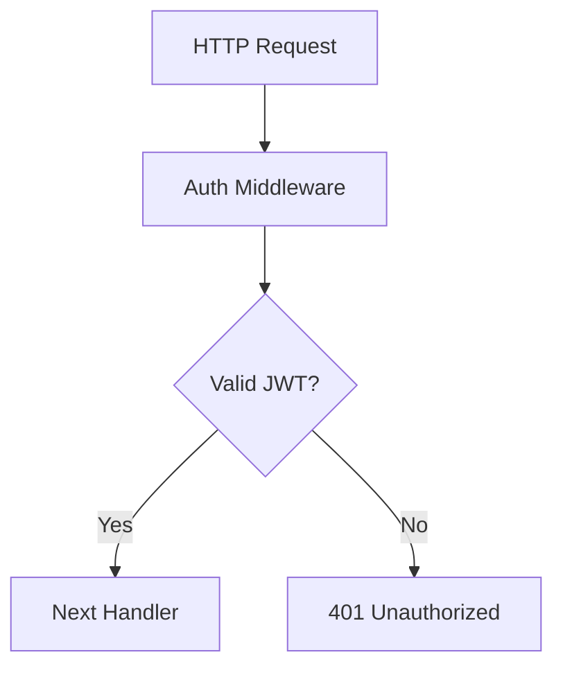

# 5D Labs Agent Platform

Multi-agent AI development platform with TaskRun CRD-based orchestration for managing Claude Code agent deployments and task lifecycle.

## 🎯 Core System: TaskRun CRD Controller

The platform's heart is the **TaskRun Custom Resource Definition** that manages Claude Code agent deployments through a Kubernetes-native controller. This system provides:

- **TaskRun CRD**: Kubernetes-native resource for defining and managing agent tasks
- **Unified Orchestrator**: Single service containing both REST API and TaskRun controller
- **ConfigMap-based Configuration**: Runtime configuration without rebuilding containers
- **Init Container Pattern**: Automatic workspace preparation with task files
- **Integrated Telemetry**: OpenTelemetry (OTLP) support for metrics and logs
- **Intelligent Error Detection**: Automatic monitoring and assistance triggering for failing tasks
- **Help Cloud**: Contextual guidance and troubleshooting capabilities for agent operations

## Components

### 1. Orchestrator Service
Unified service containing both REST API server and TaskRun controller for managing Claude Code agent deployments.

**Image**: `ghcr.io/5dlabs/platform/orchestrator:latest`

**Features**:
- REST API for task submissions (`/api/v1/pm/tasks`)
- TaskRun CRD controller with finalizers and status updates
- ConfigMap-based configuration via `taskrun-controller-config`
- OpenTelemetry integration for observability
- Intelligent error detection and assistance triggering
- Help cloud functionality for agent guidance and troubleshooting

### 2. Claude Code Development Agent
Primary implementation agent deployed via TaskRun CRD with autonomous operation capabilities.

**Image**: `ghcr.io/5dlabs/platform/claude-code:latest`

**Features**:
- Full Claude Code CLI with workspace management
- Init container workspace preparation
- Task file access via ConfigMaps (`task.md`, `design-spec.md`, `prompt.md`)
- Autonomous implementation with GitHub PR submission

### 3. Development Environment
Complete development container with Node.js, Rust, and Claude Code CLI pre-installed.

**Image**: Built from `/Dockerfile`

**Features**: Multi-language development environment for platform work

### 4. Gemini CLI
Google's official Gemini CLI integrated for advanced AI workflows and multimodal capabilities.

**Image**: `ghcr.io/5dlabs/platform/gemini-cli:latest`

**Features**:
- Command-line AI workflow tool with 1M+ token context window
- Multimodal capabilities (text, images, PDFs, sketches)
- Built-in Google Search integration
- MCP server support for tool connectivity
- Large codebase analysis and editing capabilities
- Autonomous task execution and operational automation

### 5. Telemetry Stack
Complete observability solution with VictoriaMetrics, VictoriaLogs, and Grafana.

**Endpoint**: `otel-collector-opentelemetry-collector.telemetry.svc.cluster.local:4317`

## Quick Start

### Prerequisites
- Kubernetes cluster (Kind, Talos, or cloud provider)
- Helm 3.x
- kubectl configured for your cluster
- Docker with buildx support (for local development)

### Deployment

1. **Install TaskRun CRD**:
```bash
kubectl apply -f infra/crds/taskrun-crd.yaml
kubectl wait --for condition=established --timeout=60s crd/taskruns.orchestrator.io
```

2. **Deploy Controller Configuration**:
```bash
kubectl apply -f infra/crds/taskrun-controller-config.yaml
```

3. **Deploy Orchestrator with Helm**:
```bash
helm install orchestrator ./infra/charts/orchestrator \
  --namespace orchestrator \
  --create-namespace \
--values ./infra/charts/orchestrator/values-production.yaml
```

4. **Submit Tasks via REST API**:
```bash
# Submit a task with design specification
curl -X POST http://orchestrator.local/api/v1/pm/tasks \
  -H "Content-Type: application/json" \
  -d @examples/sample-task.json

# Add context to existing task
curl -X POST http://orchestrator.local/api/v1/pm/tasks/1001/context \
  -H "Content-Type: application/json" \
  -d @examples/additional-context.json
```

5. **Monitor TaskRun Resources**:
```bash
# List all TaskRuns
kubectl get taskruns -n orchestrator

# Check specific TaskRun status
kubectl describe taskrun auth-service-task-1001 -n orchestrator

# View agent logs
kubectl logs -n orchestrator -l app=claude-agent,task-id=1001 -f
```

## Taskmaster Integration

The platform integrates seamlessly with [Task Master](https://github.com/eyaltoledano/claude-task-master) for comprehensive task management and agent collaboration.

### Complete Workflow Example

1. **Initialize and Plan Tasks with Taskmaster**:
```bash
# Install Task Master
npm install -g task-master-ai

# Initialize project
task-master init --name=auth-service --description="Authentication service implementation"

# Configure AI models (interactive setup)
task-master models --setup

# Add initial task
task-master add-task --prompt="Implement JWT authentication middleware with proper error handling and comprehensive tests" \
  --priority=high
```

2. **Create Design Specification**:
```bash
# Create comprehensive design document
cat > design-spec.md << 'EOF'
# Authentication Service Design

## Architecture Overview


## Requirements
- JWT validation under 10ms
- RS256 signature verification
- Proper error handling with status codes
- Rate limiting on auth endpoints
- Comprehensive test coverage
EOF
```

3. **Create Autonomous Agent Instructions**:
```bash
# Create detailed prompt for autonomous operation
cat > autonomous-prompt.md << 'EOF'
# Autonomous Implementation Instructions

## CRITICAL: You are operating autonomously
- No human intervention available
- Your GitHub PR is the only deliverable
- Must meet ALL acceptance criteria

## Quality Gates
- All tests must pass: `cargo test --all`
- Zero clippy warnings: `cargo clippy -- -D warnings`
- Code formatted: `cargo fmt --all`
- Performance validated: JWT validation < 10ms

## Success Criteria
Submit GitHub PR with:
- Complete JWT middleware implementation
- Comprehensive test suite
- Performance benchmarks
- Security audit clean
EOF
```

4. **Extract Task Details and Submit to Platform**:
```bash
# View task details
task-master show 1

# Extract task information manually or via script
TASK_DESCRIPTION=$(task-master show 1 | grep -A 20 "Description:" | tail -n +2)

# Submit via REST API with design specification
curl -X POST http://orchestrator.local/api/v1/pm/tasks \
  -H "Content-Type: application/json" \
  -d '{
    "taskId": 1001,
    "serviceName": "auth-service",
    "priority": "high",
    "markdownFiles": [
      {
        "filename": "task.md",
        "content": "'"$TASK_DESCRIPTION"'",
        "fileType": "task"
      },
      {
        "filename": "design-spec.md",
        "content": "'$(cat design-spec.md | sed 's/"/\\"/g')'",
        "fileType": "design-spec"
      },
      {
        "filename": "prompt.md",
        "content": "'$(cat autonomous-prompt.md | sed 's/"/\\"/g')'",
        "fileType": "prompt"
      }
    ]
  }'
```

5. **Monitor Progress**:
```bash
# Watch TaskRun status
watch kubectl get taskruns -n orchestrator

# View real-time agent logs
kubectl logs -n orchestrator -l task-id=1001 -f

# Check agent progress in workspace
kubectl exec -it -n orchestrator auth-service-task-1001-[pod] -- \
  ls -la /workspace/auth-service/
```

6. **Update Task Status**:
```bash
# Agent automatically submits GitHub PR when complete
# Review PR at: https://github.com/your-org/auth-service/pulls

# Update Taskmaster with completion
task-master set-status --id=1 --status=done

# Add implementation notes
task-master update-task --id=1 --prompt="Implementation completed by Claude agent. PR #123 submitted and merged. All tests passing, performance benchmarks met."
```

### Advanced Taskmaster Features

**Organizing Tasks with Tags**:
```bash
# Create a tag for authentication-related tasks
task-master add-tag auth-feature --description="Authentication service implementation"

# Switch to the new tag
task-master use-tag auth-feature

# Add related tasks
task-master add-task --prompt="Design authentication architecture"
task-master add-task --prompt="Implement JWT middleware" --dependencies=1
task-master add-task --prompt="Add refresh token support" --dependencies=2
task-master add-task --prompt="Integration testing" --dependencies=3

# List tasks in current tag
task-master list --with-subtasks
```

**Task Breakdown and Analysis**:
```bash
# Analyze task complexity
task-master analyze-complexity --research

# View complexity report
task-master complexity-report

# Expand complex tasks into subtasks
task-master expand --id=2 --num=5 --research

# View next actionable task
task-master next
```

**Research and Context Gathering**:
```bash
# Research best practices for implementation
task-master research "What are the current best practices for JWT authentication in Rust?" \
  --id=2 \
  --files=src/auth/mod.rs,Cargo.toml \
  --save-to=2

# Update task with research findings
task-master update-subtask --id=2.1 \
  --prompt="Research indicates using jsonwebtoken crate v9.2+ with RS256. Need to implement proper key rotation and refresh token storage."
```

**Multi-Context Development**:
```bash
# Create separate tags for different features or branches
task-master add-tag feature-payments --description="Payment processing feature"
task-master add-tag bugfix-auth --description="Authentication bug fixes"

# Copy tasks between tags
task-master copy-tag auth-feature auth-v2 --description="Version 2 authentication"

# List all available tags
task-master tags --show-metadata
```

### Integration Scripts

**Automated Task Submission**:
```bash
#!/bin/bash
# submit-task-to-platform.sh

TASK_ID=$1
TAG=${2:-$(cat .taskmaster/state.json | jq -r .currentTag)}

# Get task details
TASK_JSON=$(task-master show $TASK_ID --tag=$TAG)

# Extract task information
TITLE=$(echo "$TASK_JSON" | grep "Title:" | sed 's/Title: //')
DESCRIPTION=$(echo "$TASK_JSON" | grep -A 50 "Description:" | tail -n +2)
DETAILS=$(echo "$TASK_JSON" | grep -A 100 "Details:" | tail -n +2)

# Submit to platform
curl -X POST http://orchestrator.local/api/v1/pm/tasks \
  -H "Content-Type: application/json" \
  -d "{
    \"taskId\": $TASK_ID,
    \"serviceName\": \"$SERVICE_NAME\",
    \"priority\": \"high\",
    \"markdownFiles\": [
      {
        \"filename\": \"task.md\",
        \"content\": \"$TITLE\\n\\n$DESCRIPTION\\n\\n$DETAILS\",
        \"fileType\": \"task\"
      }
    ]
  }"
```

### Best Practices

1. **Task Organization**:
   - Use tags to separate features, versions, or team contexts
   - Keep the master tag for high-level milestones only
   - Use descriptive tag names that match git branches when applicable

2. **Task Breakdown**:
   - Run `analyze-complexity` before starting implementation
   - Use `expand` to create detailed subtasks for complex work
   - Update subtasks with `update-subtask` during implementation

3. **Progress Tracking**:
   - Use `set-status` to mark tasks as: `pending`, `in-progress`, `done`
   - Add implementation notes with `update-task` or `update-subtask`
   - Use `next` command to find the next actionable task

4. **Research Integration**:
   - Use `research` command for up-to-date best practices
   - Save research findings directly to tasks with `--save-to`
   - Include file context with `-f` flag for targeted research

### Documentation Links

- **[Task Master GitHub](https://github.com/taskmaster-ai/taskmaster)** - Source code and examples
- **[Platform Integration Guide](CLAUDE.md)** - Detailed integration instructions
- **Task Master CLI Help** - Run `task-master --help` for command reference

## Documentation Hub

📚 **[Complete Documentation](docs/)** - All platform documentation

### Key Guides:
- [TaskRun CRD Design](docs/taskrun-crd-design.md) - CRD implementation details
- [Claude Code Complete Guide](docs/claude-code-complete-guide.md) - Agent deployment reference
- [Platform Architecture Guide](docs/platform-architecture-guide.md) - System design patterns
- [Operations Complete Guide](docs/operations-complete-guide.md) - Deployment procedures
- [Task Master Integration](CLAUDE.md) - AI task management system

## Development

### Building Images

Components are built automatically via **Unified CI/CD** GitHub Actions workflow. For local development:

```bash
# Orchestrator (CRD-enabled)
cd orchestrator
cargo build --release --package orchestrator-core
docker build -t orchestrator:local .

# Development environment
docker build -t platform-dev:local .
```

### CI/CD Pipeline

The platform uses a unified CI/CD workflow (`.github/workflows/unified-ci.yml`) that:
- Builds `orchestrator:latest` with integrated TaskRun controller
- Builds `claude-code:latest` for agent deployments
- Builds `gemini-cli:latest` for advanced AI workflows
- Runs comprehensive tests including CRD integration tests
- Deploys to production on main branch pushes

### Current Architecture

The platform uses a **TaskRun CRD-based approach**:
1. **TaskRun CRD**: Kubernetes-native resource definition for agent tasks
2. **Unified Controller**: Single orchestrator service managing both API and CRD controller
3. **Init Container Pattern**: Automatic workspace preparation from ConfigMaps
4. **ConfigMap Configuration**: Runtime configuration without container rebuilds

## Architecture

```
┌─────────────────┐
│   Taskmaster    │
│ (Task Planning) │
└────────┬────────┘
         │
         ▼
┌─────────────────┐     ┌──────────────────────────┐     ┌─────────────────┐
│   PM Requests   │────▶│                          │────▶│ TaskRun CRD     │
│   GitHub Events │     │    Unified Orchestrator  │     │ Creation        │
│   CLI Calls     │     │                          │     └────────┬────────┘
└─────────────────┘     │  ┌─────────────────────┐ │              │
                        │  │    REST API         │ │              ▼
                        │  │  /api/v1/pm/tasks   │ │     ┌─────────────────┐
                        │  └─────────────────────┘ │     │  Init Container │
                        │                          │     │ (ConfigMap →    │
                        │  ┌─────────────────────┐ │     │  Workspace)     │
                        │  │  TaskRun Controller │ │     └────────┬────────┘
                        │  │  (CRD Reconciler)   │ │              │
                        │  └─────────────────────┘ │              ▼
                        └──────────────────────────┘     ┌─────────────────┐
                                   │                     │ Claude Code Job │
                                   │                     │ (Autonomous     │
                                   │                     │  Implementation)│
                                   │                     └────────┬────────┘
                                   │                              │
                                   │                     ┌────────┴────────┐
                                   ▼                     ▼                 ▼
                        ┌──────────────────┐    ┌──────────────────┐ ┌─────────────────┐
                        │ OTLP Collector   │◀───┤   (Telemetry)    │ │ GitHub PR       │
                        │ (Telemetry)      │    └──────────────────┘ │ Submission      │
                        └──────────────────┘                         └─────────────────┘
                                   │
                        ┌──────────┴──────────┐
                        ▼                     ▼
                 ┌─────────────┐      ┌─────────────┐
                 │VictoriaMetrics│    │ VictoriaLogs│
                 └─────────────┘      └─────────────┘
                        │                     │
                        └──────────┬──────────┘
                                   ▼
                           ┌─────────────┐
                           │   Grafana   │
                           └─────────────┘
```

### Key Components:

1. **Unified Orchestrator**: Single service containing both REST API and TaskRun controller
2. **TaskRun CRD**: Kubernetes-native resource for defining agent tasks
3. **ConfigMap Pattern**: Task files stored in ConfigMaps, copied by init containers
4. **Autonomous Agents**: Claude Code and Gemini CLI agents work independently and submit GitHub PRs
5. **Integrated Telemetry**: OpenTelemetry collector feeds metrics and logs to monitoring stack

## Contributing

1. Fork the repository
2. Create a feature branch
3. Review the [TaskRun CRD Design](docs/taskrun-crd-design.md)
4. Make changes with tests
5. Submit a pull request

## License

[Your license here]# Test rust-builder fixes
# Test cache fixes
