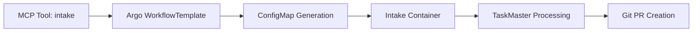

# Project Intake Workflow

The Project Intake workflow automates the process of converting Product Requirements Documents (PRDs) into TaskMaster-managed projects with generated tasks.

## Overview

Instead of manually setting up projects and creating tasks, the intake workflow:
1. Accepts a PRD and optional architecture document
2. Automatically generates TaskMaster tasks
3. Creates the project structure
4. Opens a pull request with the generated project

## Architecture



## Components

### 1. MCP Tool (`intake`)
- **Location**: `controller/mcp/src/main.rs`
- **Function**: `handle_intake_workflow`
- **Purpose**: Accepts PRD content and triggers the Argo workflow

### 2. Argo WorkflowTemplate
- **Location**: `infra/charts/controller/templates/project-intake-template.yaml`
- **Name**: `project-intake`
- **Steps**:
  1. Generate intake configuration (creates ConfigMap)
  2. Run intake container
  3. Cleanup temporary ConfigMap

### 3. Intake Script
- **Location**: `infra/charts/controller/claude-templates/intake/intake.sh.hbs`
- **Purpose**: Executes the TaskMaster workflow:
  - Clones repository
  - Initializes TaskMaster
  - Parses PRD
  - Generates tasks
  - Creates PR

## Usage

### Via MCP Tool

```javascript
// Example: Process a new project intake
const result = await mcp.callTool('intake', {
  prd_content: `
    # My New Project
    
    ## Overview
    This project will create a new API service...
    
    ## Requirements
    1. User authentication
    2. Data persistence
    3. REST API endpoints
    ...
  `,
  
  architecture_content: `
    # Architecture Design
    
    ## Technology Stack
    - Node.js with Express
    - PostgreSQL database
    - JWT authentication
    ...
  `,
  
  project_name: "my-api-service",  // Optional, auto-detected from PRD
  repository: "https://github.com/5dlabs/projects",  // Optional
  num_tasks: 50,  // Optional, default 50
  expand_tasks: true,  // Optional, default true
  analyze_complexity: true,  // Optional, default true
  model: "claude-opus-4-20250514",  // Optional
  agent: "5DLabs-Morgan"  // Optional, GitHub App for PR
});
```

### Parameters

| Parameter | Required | Description | Default |
|-----------|----------|-------------|---------|
| `prd_content` | Yes | Product Requirements Document content | - |
| `architecture_content` | No | Architecture document content | Empty |
| `project_name` | No | Project name | Auto-detected from PRD |
| `repository` | No | Target repository URL | `https://github.com/5dlabs/projects` |
| `num_tasks` | No | Number of tasks to generate | 50 |
| `expand_tasks` | No | Expand tasks with subtasks | true |
| `analyze_complexity` | No | Analyze task complexity | true |
| `model` | No | Claude model for generation | `claude-opus-4-20250514` |
| `agent` | No | GitHub App for PR creation | `5DLabs-Morgan` |

## Generated Structure

After successful intake, the following structure is created:

```
projects/<project-name>/
├── .taskmaster/
│   ├── docs/
│   │   ├── prd.txt              # Original PRD
│   │   └── architecture.md      # Architecture doc (if provided)
│   ├── tasks/
│   │   └── tasks.json          # Generated tasks
│   └── config.json             # TaskMaster configuration
├── docs/
│   ├── task-1/
│   │   └── task.md             # Individual task documentation
│   ├── task-2/
│   │   └── task.md
│   └── ...
└── README.md                   # Project overview
```

## Workflow Steps

1. **Content Submission**: PRD and optional architecture docs are submitted via MCP tool
2. **ConfigMap Creation**: Temporary ConfigMap stores the documents
3. **Container Execution**: Claude container runs with mounted documents
4. **TaskMaster Processing**:
   - Initialize project
   - Parse PRD
   - Generate tasks (with specified count)
   - Analyze complexity (optional)
   - Expand with subtasks (optional)
5. **Git Operations**:
   - Clone target repository
   - Create project structure
   - Commit changes
   - Push to new branch
6. **PR Creation**: GitHub App creates pull request
7. **Cleanup**: Temporary ConfigMap is deleted

## Configuration

### Default Models
- **Main Model**: `claude-opus-4-20250514`
- **Research Model**: Same as main (to avoid Perplexity requirement)
- **Fallback Model**: `claude-haiku-3-20240307`

### GitHub Authentication
The workflow uses GitHub App authentication configured via secrets:
- `GITHUB_APP_ID`
- `GITHUB_APP_PRIVATE_KEY`
- `GITHUB_APP_CLIENT_ID`
- `GITHUB_APP_CLIENT_SECRET`

## Benefits

1. **Automated Setup**: No manual project initialization
2. **Consistent Structure**: Every project follows the same pattern
3. **Task Generation**: AI-powered task breakdown from requirements
4. **Version Control**: Automatic PR creation for review
5. **Complexity Analysis**: Optional analysis helps prioritize tasks
6. **Subtask Expansion**: Automatic breakdown of complex tasks

## Comparison with GitHub Actions

This approach improves upon the GitHub Actions implementation by:
- **No dependency installation**: Uses pre-built Claude container
- **Better secret management**: Uses Kubernetes secrets
- **Controlled environment**: Runs in your cluster
- **Integrated with platform**: Works with existing orchestrator workflows
- **No GitHub runner limitations**: Full control over execution

## Next Steps

After intake completes:
1. Review the generated PR
2. Merge to add project to repository
3. Use `docs` and `task` MCP tools to implement tasks
4. Monitor progress via Argo workflows

## Troubleshooting

### Common Issues

1. **PRD extraction fails**: Ensure PRD has clear headings
2. **GitHub authentication fails**: Check GitHub App credentials
3. **Workflow timeout**: Default 2 hours, increase if needed
4. **Task generation fails**: Check Claude API key and model availability

### Debugging

View workflow status:
```bash
argo get intake-<timestamp> -n argo
argo logs intake-<timestamp> -n argo
```

Check ConfigMap creation:
```bash
kubectl get configmaps -n argo | grep intake
```

## Future Enhancements

- [ ] Support for multiple PRD formats (Markdown, DOCX, PDF)
- [ ] Integration with existing projects (update mode)
- [ ] Custom task templates
- [ ] Slack/Discord notifications on completion
- [ ] Batch processing of multiple projects
- [ ] PRD validation before processing
