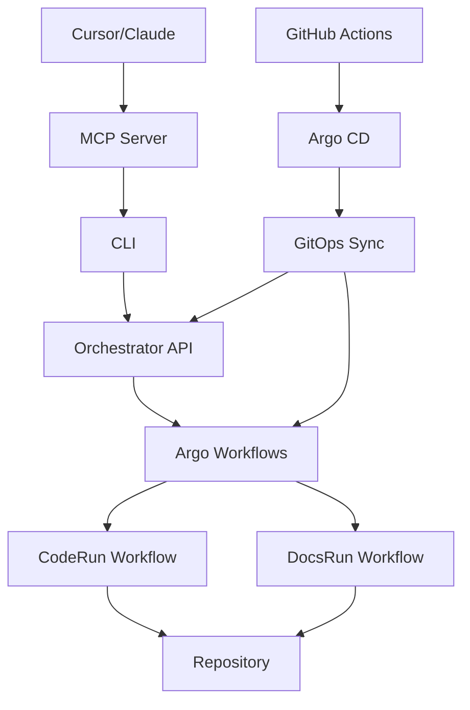

# Argo Integration for 5D Labs Platform

This document describes the integration of Argo CD and Argo Workflows with the 5D Labs Agent Platform.

## 🚀 What's New

The platform now supports GitOps deployments and advanced workflow orchestration:

### Argo CD Integration
- **GitOps Deployments**: Declarative infrastructure management
- **Automatic Sync**: Self-healing and automated deployments
- **Enhanced Security**: Git-based access control and audit trails

### Argo Workflows Integration
- **Structured Task Execution**: Replaces direct Kubernetes jobs
- **Advanced Orchestration**: Multi-step workflows with dependencies
- **Better Observability**: Detailed workflow monitoring and artifact management

## 🏗️ Enhanced Architecture



## 🚀 Quick Start with GitOps

### Complete Migration
```bash
./infra/scripts/migrate-to-gitops.sh
```

### Manual Setup
```bash
# Install Argo CD
./infra/scripts/install-argocd.sh

# Install Argo Workflows  
./infra/scripts/install-argo-workflows.sh

# Deploy GitOps applications
kubectl apply -f infra/gitops/app-of-apps.yaml
```

## 🔄 New Workflow Execution

### Before (Direct Jobs)
```
API Request → Kubernetes Job → Claude Agent → Results
```

### After (Argo Workflows)
```
API Request → Argo Workflow → Multi-Step Execution → Results
├── Setup Workspace
├── Execute Task
└── Publish Results
```

## 📁 New Directory Structure

```
infra/
├── charts/argocd/              # Argo CD installation
├── charts/argo-workflows/      # Argo Workflows installation
├── gitops/                     # GitOps applications
│   ├── applications/           # Application definitions
│   ├── projects/              # Argo CD projects
│   └── app-of-apps.yaml       # Root application
├── workflow-templates/         # Argo Workflow templates
│   ├── coderun-template.yaml  # Code task workflows
│   ├── docsrun-template.yaml  # Docs task workflows
│   └── workflow-rbac.yaml     # Workflow permissions
└── scripts/                   # Installation scripts
    ├── migrate-to-gitops.sh   # Complete migration
    ├── install-argocd.sh      # Argo CD installation
    ├── install-argo-workflows.sh # Argo Workflows installation
    └── setup-argocd-access.sh    # CI/CD access setup
```

## 🌐 Access Points

### Argo CD UI
- **NodePort**: http://localhost:30080
- **Port Forward**: `kubectl port-forward svc/argocd-server -n argocd 8080:443`
- **Login**: admin / (get password from secret)

### Argo Workflows UI
- **NodePort**: http://localhost:30081
- **Port Forward**: `kubectl port-forward svc/argo-workflows-server -n argo 2746:2746`

## 🔧 Configuration

### GitOps Applications

The platform now includes several GitOps applications:

1. **Orchestrator** (`infra/gitops/applications/orchestrator.yaml`)
   - Manages the main orchestrator service
   - Automatic sync and self-healing
   - References `infra/charts/orchestrator`

2. **Argo Workflows** (`infra/gitops/applications/argo-workflows.yaml`)
   - Manages workflow infrastructure
   - References `infra/charts/argo-workflows`

3. **Monitoring Stack** (`infra/gitops/applications/monitoring-stack.yaml`)
   - Manages telemetry infrastructure
   - References `infra/telemetry`

### Workflow Templates

#### CodeRun Template
Multi-step workflow for code implementation tasks:
1. **Setup Workspace**: Clone repositories and configure environment
2. **Execute Task**: Run Claude Code agent with full context
3. **Publish Results**: Commit changes and create pull requests

#### DocsRun Template  
Streamlined workflow for documentation generation:
1. **Setup Workspace**: Clone repository and prepare environment
2. **Generate Docs**: Run Claude Docs agent with documentation focus
3. **Publish Docs**: Commit generated documentation

## 📊 Benefits

### For Developers
- **Better Observability**: Detailed workflow execution monitoring
- **Improved Reliability**: Structured multi-step execution with retry logic
- **Enhanced Security**: Git-based deployment and access control
- **Faster Deployments**: Automated GitOps sync

### For Operations
- **Declarative Management**: All configuration in Git
- **Audit Trail**: Complete deployment history
- **Disaster Recovery**: Easy restoration from Git state
- **Scalability**: Advanced workflow orchestration

## 🔄 Migration Impact

### Existing Functionality
- **MCP Tools**: No changes to MCP server or CLI interfaces
- **API Compatibility**: Orchestrator API remains unchanged
- **Agent Execution**: Same Claude agents, enhanced orchestration

### New Capabilities
- **Workflow Monitoring**: Real-time execution tracking
- **GitOps Deployments**: Automated infrastructure management
- **Advanced Orchestration**: Complex multi-step workflows
- **Better Resource Management**: Improved cleanup and efficiency

## 🚨 Troubleshooting

### Common Issues

#### Application Sync Failures
```bash
# Check application status
kubectl get applications -n argocd

# Manual sync
kubectl patch application orchestrator -n argocd --type merge -p '{"operation":{"sync":{"revision":"HEAD"}}}'
```

#### Workflow Execution Issues
```bash
# Check workflow status
kubectl get workflows -n argo

# View workflow details
kubectl describe workflow WORKFLOW_NAME -n argo
```

#### Repository Access
```bash
# Update repository credentials
kubectl apply -f infra/charts/argocd/secrets.yaml
```

## 📚 Documentation

- **Complete Migration Guide**: [ARGO_MIGRATION_GUIDE.md](ARGO_MIGRATION_GUIDE.md)
- **GitOps README**: [infra/gitops/README.md](infra/gitops/README.md)
- **Infrastructure Overview**: [infra/README.md](infra/README.md)

## 🎯 Next Steps

1. **Run Migration**: Execute `./infra/scripts/migrate-to-gitops.sh`
2. **Configure Access**: Update repository secrets and CI/CD access
3. **Test Workflows**: Verify task execution through new workflow templates
4. **Monitor Performance**: Use Argo UIs for observability
5. **Team Training**: Familiarize team with GitOps and workflow concepts

The platform maintains full backward compatibility while providing enhanced capabilities through GitOps and advanced workflow orchestration.