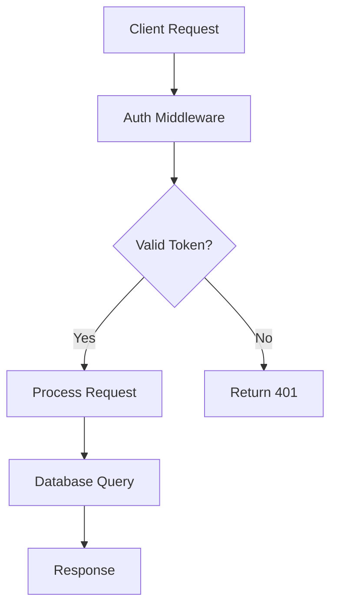

# Claude Code Complete Guide

## Overview

Claude Code is the primary implementation agent in the 5D Labs Platform, deployed automatically via TaskRun CRDs to work autonomously on software development tasks.

## Deployment Architecture

### TaskRun-Based Deployment

Claude Code agents are deployed through the TaskRun CRD system:

```yaml
apiVersion: orchestrator.io/v1
kind: TaskRun
metadata:
  name: auth-service-task-1001
spec:
  taskId: 1001
  serviceName: "auth-service"
  priority: "high"
  markdownFiles:
    - filename: "task.md"
      content: "# Implement Authentication Service..."
      fileType: "task"
```

### Container Configuration

**Image**: `ghcr.io/5dlabs/platform/claude-code:latest`

**Base Environment**:
- Node.js 20 runtime
- Rust development toolchain with Cargo
- Claude Code CLI pre-installed
- Git, GitHub CLI, and development tools

### Workspace Structure

Each agent gets a prepared workspace:

```
/workspace/auth-service/
├── .task/1001/run-1/
│   ├── task.md              # Task details and subtasks
│   ├── design-spec.md       # Comprehensive design specification
│   ├── prompt.md            # Autonomous operation instructions
│   ├── acceptance-criteria.md # Extracted acceptance criteria
│   └── metadata.yaml        # Attempt tracking and history
├── src/                     # Service source code
├── tests/                   # Test suite
└── CLAUDE.md               # Lean instructions with @imports
```

## Task File Format

### task.md
Contains the complete task definition with subtasks:

```markdown
# Task 1001: Implement Authentication Service

**Priority:** high
**Service:** auth-service
**Dependencies:** []

## Description
Implement secure authentication using JWT tokens with proper validation...

## Implementation Details
- Create middleware for token validation
- Implement login/logout endpoints
- Add refresh token mechanism

## Test Strategy
ACCEPTANCE CRITERIA:
1. Tokens validated within 10ms
2. Invalid tokens rejected with proper errors
3. Token refresh works correctly
4. Integration tests verify all endpoints
5. Unit tests cover edge cases

## Subtasks
### 1. Create Token Validation Middleware
- Implement JWT validation logic
- Add proper error handling
- Unit tests for validation scenarios

### 2. Implement Authentication Endpoints
- POST /auth/login
- POST /auth/logout  
- POST /auth/refresh
- Integration tests for all endpoints
```

### design-spec.md
Comprehensive design specification with architecture diagrams:

```markdown
# Authentication Service Design Specification

## Architecture Overview



## Component Specifications

### JWT Validation Middleware
- **Purpose**: Validate incoming JWT tokens
- **Input**: Authorization header with Bearer token
- **Output**: Validated user context or 401 error
- **Performance**: < 10ms validation time

### Token Endpoints
- **Login**: POST /auth/login
  - Input: username/password
  - Output: JWT access token + refresh token
- **Refresh**: POST /auth/refresh
  - Input: valid refresh token
  - Output: new access token

## Security Requirements
- JWT secret stored in Kubernetes Secret
- Tokens expire after 1 hour
- Refresh tokens valid for 7 days
- Rate limiting on auth endpoints
```

### prompt.md
Autonomous operation instructions:

```markdown
# Autonomous Claude Code Agent Instructions

## CRITICAL: You Are Operating Autonomously

You are implementing an authentication service in an isolated Kubernetes environment with **no human intervention**. Your work will only be reviewed through the GitHub pull request you submit.

## Quality Requirements

### After EVERY subtask completion:
- Run `cargo test --all` and ensure all tests pass
- Run `cargo clippy --all-targets --all-features -- -D warnings` with zero warnings
- Run `cargo fmt --all` for consistent formatting
- Validate acceptance criteria from design specification

### Before task completion:
- All acceptance criteria must be met
- Integration tests prove the service works end-to-end
- Performance requirements validated (< 10ms token validation)
- Security audit shows no vulnerabilities

## GitHub Integration

You MUST submit a GitHub pull request when complete:

```bash
git add .
git commit -m "feat: implement authentication service

- JWT token validation middleware
- Login/logout/refresh endpoints  
- Comprehensive test suite
- All acceptance criteria validated

Closes #1001"

git push origin task-1001-auth-service

gh pr create --title "Complete Task 1001: Authentication Service" --body "
## Summary
Implemented complete authentication service with JWT validation.

## Changes Made
- JWT validation middleware with < 10ms performance
- Authentication endpoints (login/logout/refresh)
- Comprehensive test suite with 95% coverage
- Security audit clean

## Testing
- ✅ All tests passing (cargo test --all)
- ✅ No clippy warnings (cargo clippy)
- ✅ Performance validated (< 10ms token validation)
- ✅ Security audit clean

🤖 Generated by Claude Code Agent - Task 1001
"
```

## Success Criteria

Task is complete ONLY when:
1. ✅ All subtasks implemented and tested
2. ✅ All acceptance criteria validated
3. ✅ Performance requirements met
4. ✅ Security audit clean
5. ✅ GitHub PR submitted with comprehensive description
```

## Agent Capabilities

### Development Tools
- **Rust/Cargo**: Primary development environment
- **Testing**: Unit tests, integration tests, benchmarks
- **Code Quality**: Clippy linting, Rustfmt formatting
- **Git Integration**: Full Git workflow with GitHub CLI
- **Package Management**: Cargo dependency management

### Autonomous Features
- **Self-Directed**: Works without human intervention
- **Quality Assurance**: Automated testing and validation
- **Error Recovery**: Handles compilation and test failures
- **Progress Tracking**: Updates task status and attempts
- **Documentation**: Maintains code documentation

### Environment Access
- **Kubernetes API**: Can query cluster resources
- **GitHub API**: Full repository access via GitHub CLI
- **Package Registries**: Access to crates.io, npm, etc.
- **External APIs**: Can make HTTP requests for testing

## Common Workflows

### Standard Implementation Flow

1. **Read Task Context**
   ```bash
   # Agent automatically loads CLAUDE.md with @imports
   # Reads task.md, design-spec.md, prompt.md
   ```

2. **Understand Requirements**
   ```bash
   # Parse acceptance criteria
   # Review design specification
   # Understand performance requirements
   ```

3. **Implement Subtasks**
   ```bash
   # Work through subtasks sequentially
   # Run tests after each subtask
   # Validate acceptance criteria progressively
   ```

4. **Quality Assurance**
   ```bash
   cargo test --all
   cargo clippy --all-targets --all-features -- -D warnings
   cargo fmt --all
   cargo bench  # if applicable
   ```

5. **Submit Results**
   ```bash
   # Commit changes
   # Push to feature branch
   # Create GitHub PR with detailed description
   ```

### Error Handling Workflow

1. **Compilation Errors**
   - Read error messages carefully
   - Fix syntax and type errors
   - Re-run `cargo check` until clean

2. **Test Failures**
   - Analyze test output
   - Fix implementation issues
   - Ensure all tests pass before proceeding

3. **Performance Issues**
   - Profile code with `cargo bench`
   - Optimize critical paths
   - Validate against requirements

4. **Security Issues**
   - Run `cargo audit`
   - Fix any security vulnerabilities
   - Follow security best practices

## Integration with Platform

### TaskRun Lifecycle

1. **Creation**: TaskRun CRD created with task details
2. **Preparation**: Init container sets up workspace
3. **Execution**: Claude Code agent starts autonomously
4. **Monitoring**: Controller tracks job status
5. **Completion**: Agent submits PR and completes

### Status Reporting

The agent reports status through:
- **Exit Codes**: 0 for success, non-zero for failure
- **Logs**: Structured logging for debugging
- **Files**: Creates status files in workspace
- **Git History**: Commit messages show progress

### Configuration

Agent behavior controlled by:
- **Environment Variables**: API keys, configuration
- **ConfigMaps**: Task-specific settings
- **Secrets**: Sensitive credentials
- **CLAUDE.md**: Task-specific instructions

## Monitoring and Debugging

### Viewing Agent Logs

```bash
# Real-time logs for specific task
kubectl logs -n orchestrator -l app=claude-agent,task-id=1001 -f

# Logs for specific attempt
kubectl logs -n orchestrator auth-service-task-1001-run-1-[pod-suffix] -f

# Controller logs
kubectl logs -n orchestrator -l app=orchestrator -f
```

### Checking Agent Status

```bash
# TaskRun status
kubectl describe taskrun auth-service-task-1001 -n orchestrator

# Job status  
kubectl get jobs -n orchestrator -l task-id=1001

# Pod status
kubectl get pods -n orchestrator -l task-id=1001
```

### Accessing Agent Workspace

```bash
# Exec into running agent
kubectl exec -it -n orchestrator auth-service-task-1001-run-1-[pod-suffix] -- /bin/bash

# Check workspace contents
kubectl exec -it -n orchestrator auth-service-task-1001-run-1-[pod-suffix] -- ls -la /workspace/auth-service/
```

## Best Practices

### Task Design
1. **Clear Acceptance Criteria**: Specific, measurable requirements
2. **Comprehensive Design Specs**: Detailed architecture and requirements
3. **Realistic Timeframes**: Allow adequate time for quality implementation
4. **Proper Dependencies**: Ensure prerequisites are available

### Quality Assurance
1. **Test-Driven Development**: Write tests first, implement second
2. **Continuous Validation**: Test after every change
3. **Performance Monitoring**: Validate performance requirements continuously
4. **Security First**: Security considerations throughout development

### Error Prevention
1. **Detailed Instructions**: Provide comprehensive autonomous prompts
2. **Resource Limits**: Set appropriate CPU/memory limits
3. **Timeout Management**: Configure realistic deadlines
4. **Retry Strategy**: Plan for transient failures

## Troubleshooting

### Common Issues

1. **Agent Timeout**
   - Increase `activeDeadlineSeconds` in TaskRun
   - Check for infinite loops or blocking operations
   - Review task complexity and split if needed

2. **Compilation Failures**
   - Check dependency versions
   - Verify Rust toolchain compatibility
   - Review error logs for specific issues

3. **Test Failures**
   - Check acceptance criteria alignment
   - Verify test environment setup
   - Review test data and mocking

4. **Resource Constraints**
   - Increase memory/CPU limits
   - Optimize workspace size
   - Review container resource usage

### Recovery Procedures

1. **Restart Failed Task**
   ```bash
   # Increment retry attempt
   kubectl patch taskrun auth-service-task-1001 -n orchestrator --type='merge' -p='{"spec":{"retryAttempt":2}}'
   ```

2. **Manual Intervention**
   ```bash
   # Access agent workspace for debugging
   kubectl exec -it -n orchestrator auth-service-task-1001-run-1-[pod-suffix] -- /bin/bash
   ```

3. **Task Cancellation**
   ```bash
   # Delete TaskRun to stop execution
   kubectl delete taskrun auth-service-task-1001 -n orchestrator
   ```

## Performance Optimization

### Agent Performance
- **Resource Allocation**: Right-size CPU/memory based on task complexity
- **Workspace Optimization**: Minimize unnecessary files and dependencies
- **Network Optimization**: Use local caches where possible

### Task Efficiency
- **Parallel Subtasks**: Design independent subtasks for parallel execution
- **Incremental Testing**: Test frequently to catch issues early
- **Smart Caching**: Leverage Cargo build cache and dependency cache

## Security Considerations

### Secret Management
- **API Keys**: Stored in Kubernetes Secrets
- **GitHub Tokens**: Scoped to minimum required permissions
- **Service Credentials**: Injected securely via environment variables

### Code Security
- **Dependency Scanning**: Regular `cargo audit` runs
- **Code Review**: Automated via GitHub PR process
- **Static Analysis**: Clippy with security-focused rules

### Runtime Security
- **Non-Root Execution**: Agents run as non-root user
- **Resource Limits**: Prevent resource exhaustion attacks
- **Network Policies**: Restrict unnecessary network access

## Future Enhancements

1. **Multi-Language Support**: Python, Go, TypeScript agents
2. **Advanced Debugging**: Interactive debugging capabilities
3. **Performance Profiling**: Built-in performance analysis
4. **Code Review Integration**: Automated code review feedback
5. **Collaborative Agents**: Multi-agent task collaboration