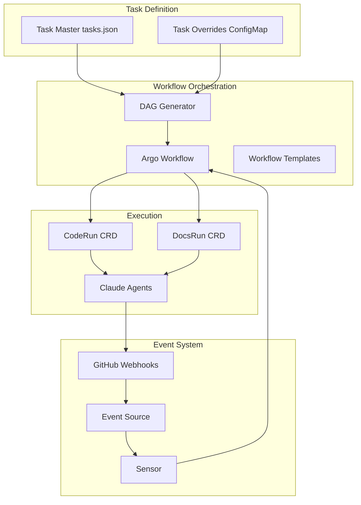

# Task Master Orchestration with Argo Workflows & Events

## Table of Contents

1. [Architecture Overview](#architecture-overview)
2. [Core Concepts & Design](#core-concepts--design)
3. [Installation & Setup](#installation--setup)
4. [Task Master Integration](#task-master-integration)
5. [Workflow Templates](#workflow-templates)
6. [Event-Driven Automation](#event-driven-automation)
7. [Dynamic Task Management](#dynamic-task-management)
8. [Complete Implementation Example](#complete-implementation-example)
9. [Operations & Management](#operations--management)
10. [Migration Strategy](#migration-strategy)

## Architecture Overview

### The Vision

Transform your Task Master project orchestration into a fully automated, event-driven system where:
- **Argo Workflows** executes your tasks in dependency order
- **Argo Events** handles GitHub webhooks to progress through tasks automatically
- **Task Master** remains your source of truth for task definitions
- **Your existing tools** (MCP, orchestrator) continue to work seamlessly

### System Flow



## Core Concepts & Design

### Key Design Principles

1. **Single Source of Truth**: Task Master's `tasks.json` defines all tasks
2. **Event-Driven Progression**: PR merges automatically trigger next tasks
3. **Dynamic Adaptation**: Tasks can be modified/skipped without changing core workflows
4. **Observability**: Every action is visible in Argo UI
5. **Resumability**: Failures don't break the entire project flow

### Component Responsibilities

| Component | Purpose | Key Features |
|-----------|---------|--------------|
| **Argo Workflows** | Task execution engine | DAG support, retries, artifacts |
| **Argo Events** | Event handling | GitHub webhooks, sensors, triggers |
| **Task Master** | Task definitions | Dependencies, descriptions, status |
| **ConfigMaps** | Runtime configuration | Overrides, skips, modifications |
| **Your Orchestrator** | Agent execution | Creates jobs, manages PVCs |

## Installation & Setup

### Prerequisites

```bash
# Your existing setup
kubectl config use-context rancher-desktop  # or your cluster

# Verify installations
kubectl get pods -n argo
kubectl get pods -n argo-events
kubectl get pods -n orchestrator
```

### Additional Argo Components

```bash
# Install Argo Events if not already installed
kubectl create namespace argo-events
kubectl apply -f https://raw.githubusercontent.com/argoproj/argo-events/stable/manifests/install.yaml
kubectl apply -f https://raw.githubusercontent.com/argoproj/argo-events/stable/manifests/install-validating-webhook.yaml

# Create service account with necessary permissions
kubectl apply -f - <<EOF
apiVersion: v1
kind: ServiceAccount
metadata:
  name: argo-orchestrator
  namespace: argo
---
apiVersion: rbac.authorization.k8s.io/v1
kind: ClusterRole
metadata:
  name: argo-orchestrator
rules:
- apiGroups: [""]
  resources: ["configmaps", "secrets", "pods", "pods/log"]
  verbs: ["get", "list", "watch", "create", "update", "patch", "delete"]
- apiGroups: ["argoproj.io"]
  resources: ["workflows", "workflowtemplates", "cronworkflows"]
  verbs: ["get", "list", "watch", "create", "update", "patch", "delete"]
- apiGroups: ["orchestrator.platform"]
  resources: ["coderuns", "docsruns"]
  verbs: ["get", "list", "watch", "create", "update", "patch", "delete"]
- apiGroups: [""]
  resources: ["persistentvolumeclaims"]
  verbs: ["get", "list", "create", "delete"]
---
apiVersion: rbac.authorization.k8s.io/v1
kind: ClusterRoleBinding
metadata:
  name: argo-orchestrator
roleRef:
  apiGroup: rbac.authorization.k8s.io
  kind: ClusterRole
  name: argo-orchestrator
subjects:
- kind: ServiceAccount
  name: argo-orchestrator
  namespace: argo
EOF
```

## Task Master Integration

### Dynamic Task Loader

This component reads your Task Master files and converts them to Argo workflows:

```yaml
apiVersion: v1
kind: ConfigMap
metadata:
  name: taskmaster-loader
  namespace: argo
data:
  loader.py: |
    import json
    import yaml
    import sys
    from datetime import datetime
    
    def load_tasks(tasks_file="/workspace/.taskmaster/tasks/tasks.json"):
        """Load tasks from Task Master JSON file"""
        with open(tasks_file, 'r') as f:
            data = json.load(f)
        return data.get('master', {}).get('tasks', [])
    
    def task_to_argo_task(task, skip_completed=True):
        """Convert Task Master task to Argo DAG task"""
        if skip_completed and task['status'] in ['done', 'cancelled']:
            return None
            
        argo_task = {
            'name': f"task-{task['id']}",
            'template': 'execute-task',
            'arguments': {
                'parameters': [
                    {'name': 'task-id', 'value': str(task['id'])},
                    {'name': 'task-title', 'value': task['title']},
                    {'name': 'task-details', 'value': json.dumps({
                        'description': task['description'],
                        'details': task['details'],
                        'test_strategy': task.get('testStrategy', ''),
                        'priority': task['priority']
                    })}
                ]
            }
        }
        
        # Add dependencies
        if task['dependencies']:
            argo_task['dependencies'] = [f"task-{dep}" for dep in task['dependencies']]
            
        return argo_task
    
    def generate_workflow_spec(tasks):
        """Generate complete Argo Workflow spec from tasks"""
        dag_tasks = []
        
        for task in tasks:
            argo_task = task_to_argo_task(task)
            if argo_task:
                dag_tasks.append(argo_task)
        
        workflow = {
            'apiVersion': 'argoproj.io/v1alpha1',
            'kind': 'Workflow',
            'metadata': {
                'generateName': 'taskmaster-project-',
                'namespace': 'argo',
                'labels': {
                    'workflows.argoproj.io/archive-strategy': 'false'
                }
            },
            'spec': {
                'serviceAccountName': 'argo-orchestrator',
                'entrypoint': 'taskmaster-dag',
                'templates': [
                    {
                        'name': 'taskmaster-dag',
                        'dag': {
                            'tasks': dag_tasks
                        }
                    }
                ]
            }
        }
        
        return workflow
    
    if __name__ == "__main__":
        tasks = load_tasks()
        workflow = generate_workflow_spec(tasks)
        print(yaml.dump(workflow, default_flow_style=False))
```

### Task Override System

Allow runtime modifications without changing tasks.json:

```yaml
apiVersion: v1
kind: ConfigMap
metadata:
  name: task-overrides
  namespace: argo
data:
  overrides.yaml: |
    # Skip tasks
    skip_tasks:
      - id: 5
        reason: "Decided to postpone caching implementation"
      - id: 12
        reason: "Feature not needed anymore"
    
    # Modify task parameters
    modify_tasks:
      - id: 8
        changes:
          test_strategy: "unit-tests-only"
          priority: "low"
      - id: 15
        changes:
          details: "Updated approach based on architectural review"
          
    # Add new dependencies
    add_dependencies:
      - task_id: 20
        depends_on: [18, 19]
        
    # Custom execution parameters
    execution_params:
      - id: 10
        model: "claude-opus-4-20250514"  # Use Opus for complex task
      - id: "*"  # Default for all tasks
        timeout: "3h"
        retries: 2
```

## Workflow Templates

### Master Orchestrator Template

```yaml
apiVersion: argoproj.io/v1alpha1
kind: WorkflowTemplate
metadata:
  name: taskmaster-orchestrator
  namespace: argo
spec:
  serviceAccountName: argo-orchestrator
  entrypoint: orchestrate-project
  
  volumeClaimTemplates:
  - metadata:
      name: workspace
    spec:
      accessModes: ["ReadWriteOnce"]
      resources:
        requests:
          storage: 10Gi
          
  templates:
  # Main orchestration flow
  - name: orchestrate-project
    steps:
    - - name: load-project
        template: git-clone
        arguments:
          parameters:
          - name: repo
            value: "git@github.com:5dlabs/platform.git"
          - name: branch
            value: "main"
            
    - - name: parse-tasks
        template: load-taskmaster
        
    - - name: apply-overrides
        template: merge-overrides
        arguments:
          parameters:
          - name: tasks
            value: "{{steps.parse-tasks.outputs.parameters.tasks}}"
            
    - - name: execute-project
        templateRef:
          name: taskmaster-executor
          template: execute-dag
        arguments:
          parameters:
          - name: tasks
            value: "{{steps.apply-overrides.outputs.parameters.tasks}}"
            
  # Clone repository
  - name: git-clone
    inputs:
      parameters:
      - name: repo
      - name: branch
    container:
      image: alpine/git:latest
      command: [sh, -c]
      args:
        - |
          git clone {{inputs.parameters.repo}} /workspace
          cd /workspace
          git checkout {{inputs.parameters.branch}}
      volumeMounts:
      - name: workspace
        mountPath: /workspace
        
  # Load Task Master tasks
  - name: load-taskmaster
    script:
      image: python:3.11-slim
      command: [python]
      source: |
        import json
        import yaml
        
        with open('/workspace/.taskmaster/tasks/tasks.json', 'r') as f:
            tasks = json.load(f)['master']['tasks']
        
        # Filter to pending tasks only
        pending_tasks = [t for t in tasks if t['status'] == 'pending']
        
        # Output as JSON parameter
        print(json.dumps(pending_tasks))
      volumeMounts:
      - name: workspace
        mountPath: /workspace
    outputs:
      parameters:
      - name: tasks
        valueFrom:
          path: /tmp/tasks.json
          
  # Apply overrides
  - name: merge-overrides
    inputs:
      parameters:
      - name: tasks
    script:
      image: python:3.11-slim
      command: [python]
      source: |
        import json
        import yaml
        
        tasks = json.loads('''{{inputs.parameters.tasks}}''')
        
        # Load overrides
        with open('/etc/overrides/overrides.yaml', 'r') as f:
            overrides = yaml.safe_load(f)
        
        # Apply skip logic
        skip_ids = [s['id'] for s in overrides.get('skip_tasks', [])]
        tasks = [t for t in tasks if t['id'] not in skip_ids]
        
        # Apply modifications
        for mod in overrides.get('modify_tasks', []):
            for task in tasks:
                if task['id'] == mod['id']:
                    task.update(mod['changes'])
        
        print(json.dumps(tasks))
      volumeMounts:
      - name: task-overrides
        mountPath: /etc/overrides
    outputs:
      parameters:
      - name: tasks
        valueFrom:
          path: /tmp/tasks.json
```

### Task Execution Template

```yaml
apiVersion: argoproj.io/v1alpha1
kind: WorkflowTemplate
metadata:
  name: taskmaster-executor
  namespace: argo
spec:
  serviceAccountName: argo-orchestrator
  
  templates:
  # Dynamic DAG from tasks
  - name: execute-dag
    inputs:
      parameters:
      - name: tasks
    dag:
      tasks:
      - name: "task-{{item.id}}"
        template: execute-single-task
        arguments:
          parameters:
          - name: task
            value: "{{item}}"
        dependencies: >-
          {{- if item.dependencies -}}
          [{{range $i, $dep := item.dependencies}}{{if $i}},{{end}}"task-{{$dep}}"{{end}}]
          {{- else -}}
          []
          {{- end -}}
        withParam: "{{inputs.parameters.tasks}}"
        
  # Execute a single task
  - name: execute-single-task
    inputs:
      parameters:
      - name: task
    steps:
    # Phase 1: Code Implementation
    - - name: implement-code
        template: trigger-coderun
        arguments:
          parameters:
          - name: task-id
            value: "{{inputs.parameters.task.id}}"
          - name: task-details
            value: "{{inputs.parameters.task}}"
            
    # Phase 2: Automated Testing
    - - name: run-tests
        template: automated-testing
        arguments:
          parameters:
          - name: task-id
            value: "{{inputs.parameters.task.id}}"
          - name: branch
            value: "task-{{inputs.parameters.task.id}}"
            
    # Phase 3: Create PR
    - - name: create-pr
        template: github-pr-creation
        arguments:
          parameters:
          - name: task-id
            value: "{{inputs.parameters.task.id}}"
          - name: branch
            value: "task-{{inputs.parameters.task.id}}"
          - name: title
            value: "{{inputs.parameters.task.title}}"
            
    # Phase 4: Wait for Review
    - - name: await-review
        template: review-gate
        arguments:
          parameters:
          - name: pr-number
            value: "{{steps.create-pr.outputs.parameters.pr-number}}"
            
  # Trigger CodeRun CRD
  - name: trigger-coderun
    inputs:
      parameters:
      - name: task-id
      - name: task-details
    resource:
      action: create
      manifest: |
        apiVersion: orchestrator.platform/v1
        kind: CodeRun
        metadata:
          generateName: "task-{{inputs.parameters.task-id}}-"
          namespace: orchestrator
        spec:
          taskId: {{inputs.parameters.task-id}}
          service: "platform"
          repository: "5dlabs/platform"
          docsRepository: "5dlabs/platform"
          docsProjectDirectory: "."
          workingDirectory: "."
          githubUser: "jonathonfritz"
          model: "claude-sonnet-4-20250514"
          continueSession: false
    successCondition: status.phase == Succeeded
    failureCondition: status.phase == Failed
```

## Event-Driven Automation

### GitHub Webhook EventSource

```yaml
apiVersion: argoproj.io/v1alpha1
kind: EventSource
metadata:
  name: github-taskmaster
  namespace: argo-events
spec:
  github:
    platform:
      repositories:
        - owner: "5dlabs"
          names:
            - "platform"
      webhook:
        endpoint: /github
        port: "12000"
        method: POST
        url: https://your-domain.com  # You'll expose this
      events:
        - pull_request
        - push
      apiToken:
        name: github-token
        key: token
      insecureSSL: false
      active: true
```

### PR Merge Sensor

```yaml
apiVersion: argoproj.io/v1alpha1
kind: Sensor
metadata:
  name: pr-merge-sensor
  namespace: argo-events
spec:
  template:
    serviceAccountName: argo-events-sa
  dependencies:
    - name: github-pr-merged
      eventSourceName: github-taskmaster
      eventName: platform
      filters:
        data:
          - path: body.action
            type: string
            value: ["closed"]
          - path: body.pull_request.merged
            type: bool
            value: ["true"]
          - path: body.pull_request.base.ref
            type: string
            value: ["main"]
            
  triggers:
    - template:
        name: process-merge
        k8s:
          operation: create
          source:
            resource:
              apiVersion: argoproj.io/v1alpha1
              kind: Workflow
              metadata:
                generateName: post-merge-
                namespace: argo
              spec:
                serviceAccountName: argo-orchestrator
                entrypoint: handle-merge
                arguments:
                  parameters:
                  - name: pr-number
                    value: ""
                  - name: branch
                    value: ""
                  - name: task-id
                    value: ""
                templates:
                - name: handle-merge
                  steps:
                  - - name: extract-task-id
                      template: parse-branch
                  - - name: update-task-status
                      template: mark-complete
                      arguments:
                        parameters:
                        - name: task-id
                          value: "{{steps.extract-task-id.outputs.parameters.task-id}}"
                  - - name: trigger-next
                      template: find-and-trigger-next
                      arguments:
                        parameters:
                        - name: completed-task
                          value: "{{steps.extract-task-id.outputs.parameters.task-id}}"
          parameters:
            - src:
                dependencyName: github-pr-merged
                dataKey: body.pull_request.number
              dest: spec.arguments.parameters.0.value
            - src:
                dependencyName: github-pr-merged
                dataKey: body.pull_request.head.ref
              dest: spec.arguments.parameters.1.value
```

### Task Progression Logic

```yaml
apiVersion: v1
kind: ConfigMap
metadata:
  name: task-progression
  namespace: argo
data:
  find_next.py: |
    import json
    import yaml
    
    def find_next_tasks(completed_task_id, tasks_file="/workspace/.taskmaster/tasks/tasks.json"):
        """Find all tasks that can now be started after completing a task"""
        
        with open(tasks_file, 'r') as f:
            data = json.load(f)
        
        tasks = data.get('master', {}).get('tasks', [])
        
        # Find tasks that:
        # 1. Are pending
        # 2. Have the completed task as a dependency
        # 3. Have all other dependencies completed
        
        completed_ids = {int(completed_task_id)}
        for task in tasks:
            if task['status'] == 'done':
                completed_ids.add(task['id'])
        
        next_tasks = []
        for task in tasks:
            if task['status'] != 'pending':
                continue
                
            if not task['dependencies']:
                continue
                
            # Check if all dependencies are completed
            if all(dep in completed_ids for dep in task['dependencies']):
                # This task was waiting for our completed task
                if int(completed_task_id) in task['dependencies']:
                    next_tasks.append(task)
        
        return next_tasks
    
    if __name__ == "__main__":
        import sys
        completed_id = sys.argv[1] if len(sys.argv) > 1 else "1"
        next_tasks = find_next_tasks(completed_id)
        
        # Output task IDs that should be triggered
        for task in next_tasks:
            print(f"trigger-task-{task['id']}")
```

## Dynamic Task Management

### Skip Task Workflow

```yaml
apiVersion: argoproj.io/v1alpha1
kind: WorkflowTemplate
metadata:
  name: task-management
  namespace: argo
spec:
  templates:
  # Skip a task
  - name: skip-task
    inputs:
      parameters:
      - name: task-id
      - name: reason
    steps:
    - - name: update-overrides
        template: add-skip-override
        arguments:
          parameters:
          - name: task-id
            value: "{{inputs.parameters.task-id}}"
          - name: reason
            value: "{{inputs.parameters.reason}}"
            
    - - name: update-dependents
        template: cascade-skip
        arguments:
          parameters:
          - name: skipped-task
            value: "{{inputs.parameters.task-id}}"
            
  # Add skip to overrides
  - name: add-skip-override
    inputs:
      parameters:
      - name: task-id
      - name: reason
    script:
      image: python:3.11-slim
      command: [python]
      source: |
        import yaml
        import json
        from datetime import datetime
        
        # Read current overrides
        with open('/etc/overrides/overrides.yaml', 'r') as f:
            overrides = yaml.safe_load(f) or {}
        
        # Add new skip
        if 'skip_tasks' not in overrides:
            overrides['skip_tasks'] = []
            
        overrides['skip_tasks'].append({
            'id': int('{{inputs.parameters.task-id}}'),
            'reason': '{{inputs.parameters.reason}}',
            'timestamp': datetime.now().isoformat()
        })
        
        # Update configmap (in real implementation, use K8s API)
        print(yaml.dump(overrides))
```

### Modify Task Workflow

```yaml
apiVersion: argoproj.io/v1alpha1
kind: WorkflowTemplate
metadata:
  name: task-modifications
  namespace: argo
spec:
  templates:
  # Modify task details
  - name: modify-task
    inputs:
      parameters:
      - name: task-id
      - name: changes  # JSON object with changes
    steps:
    - - name: validate-changes
        template: validate-modifications
        arguments:
          parameters:
          - name: task-id
            value: "{{inputs.parameters.task-id}}"
          - name: changes
            value: "{{inputs.parameters.changes}}"
            
    - - name: apply-changes
        template: update-override
        arguments:
          parameters:
          - name: task-id
            value: "{{inputs.parameters.task-id}}"
          - name: changes
            value: "{{inputs.parameters.changes}}"
            
    - - name: restart-if-running
        template: check-and-restart
        arguments:
          parameters:
          - name: task-id
            value: "{{inputs.parameters.task-id}}"
```

## Complete Implementation Example

### Full Project Workflow

Let's walk through a complete example of running your entire project:

```yaml
# 1. Deploy all base components
kubectl apply -f - <<EOF
# EventBus for Argo Events
apiVersion: argoproj.io/v1alpha1
kind: EventBus
metadata:
  name: default
  namespace: argo-events
spec:
  nats:
    native:
      replicas: 3
      auth: token
---
# Main workflow to start project
apiVersion: argoproj.io/v1alpha1
kind: Workflow
metadata:
  name: platform-development
  namespace: argo
spec:
  serviceAccountName: argo-orchestrator
  entrypoint: full-project
  
  volumeClaimTemplates:
  - metadata:
      name: project-workspace
    spec:
      accessModes: ["ReadWriteOnce"]
      storageClassName: local-path
      resources:
        requests:
          storage: 20Gi
          
  templates:
  - name: full-project
    steps:
    # Initialize project
    - - name: setup
        template: project-setup
        
    # Load and validate tasks
    - - name: validate
        template: validate-tasks
        
    # Start main execution
    - - name: execute
        templateRef:
          name: taskmaster-orchestrator
          template: orchestrate-project
          
  - name: project-setup
    container:
      image: ghcr.io/5dlabs/platform/toolman:latest
      command: [sh, -c]
      args:
        - |
          # Clone repository
          git clone git@github.com:5dlabs/platform.git /workspace
          cd /workspace
          
          # Verify Task Master files
          if [ ! -f .taskmaster/tasks/tasks.json ]; then
            echo "ERROR: Task Master not initialized"
            exit 1
          fi
          
          # Create status tracking
          mkdir -p /workspace/.argo
          echo '{"status": "initialized", "timestamp": "'$(date -u +"%Y-%m-%dT%H:%M:%SZ")'"}'  > /workspace/.argo/status.json
      volumeMounts:
      - name: project-workspace
        mountPath: /workspace
EOF
```

### Running a Specific Task

```bash
# Submit a single task
argo submit -n argo --from workflowtemplate/taskmaster-executor \
  -p tasks='[{"id": 5, "title": "Implement caching", "dependencies": []}]'

# Skip a task
kubectl apply -f - <<EOF
apiVersion: argoproj.io/v1alpha1
kind: Workflow
metadata:
  name: skip-task-5
  namespace: argo
spec:
  entrypoint: skip
  templates:
  - name: skip
    templateRef:
      name: task-management
      template: skip-task
    arguments:
      parameters:
      - name: task-id
        value: "5"
      - name: reason
        value: "Postponing caching implementation to v2"
EOF

# Modify a task
argo submit -n argo --from workflowtemplate/task-modifications \
  -p task-id=8 \
  -p changes='{"test_strategy": "integration-only", "priority": "high"}'
```

### Monitoring Progress

```bash
# Watch overall project progress
argo watch -n argo platform-development

# Get task statuses
kubectl get workflows -n argo -l taskmaster=true

# View specific task logs
argo logs -n argo task-5-xxxxx

# Check events
kubectl get events -n argo-events --sort-by='.lastTimestamp'
```

## Operations & Management

### Dashboard Setup

Create a simple dashboard to monitor your project:

```yaml
apiVersion: v1
kind: ConfigMap
metadata:
  name: taskmaster-dashboard
  namespace: argo
data:
  dashboard.html: |
    <!DOCTYPE html>
    <html>
    <head>
        <title>Task Master Project Dashboard</title>
        <style>
            body { font-family: Arial, sans-serif; margin: 20px; }
            .task { 
                border: 1px solid #ddd; 
                padding: 10px; 
                margin: 10px 0;
                border-radius: 5px;
            }
            .pending { background-color: #fff3cd; }
            .running { background-color: #cfe2ff; }
            .completed { background-color: #d1e7dd; }
            .failed { background-color: #f8d7da; }
            .skipped { background-color: #e2e3e5; }
        </style>
    </head>
    <body>
        <h1>Task Master Project Status</h1>
        <div id="tasks"></div>
        <script>
            // Poll Argo API for workflow status
            async function updateStatus() {
                const response = await fetch('/api/v1/workflows/argo');
                const data = await response.json();
                
                // Update UI
                document.getElementById('tasks').innerHTML = 
                    data.items.map(wf => {
                        const taskId = wf.metadata.name.match(/task-(\d+)/)?.[1];
                        return `
                            <div class="task ${wf.status.phase.toLowerCase()}">
                                <h3>Task ${taskId}: ${wf.metadata.labels?.['task-title']}</h3>
                                <p>Status: ${wf.status.phase}</p>
                                <p>Started: ${wf.status.startedAt}</p>
                                ${wf.status.finishedAt ? `<p>Finished: ${wf.status.finishedAt}</p>` : ''}
                            </div>
                        `;
                    }).join('');
            }
            
            setInterval(updateStatus, 5000);
            updateStatus();
        </script>
    </body>
    </html>
```

### Useful Aliases

Add these to your shell for quick access:

```bash
# ~/.bashrc or ~/.zshrc
alias tm-status='argo list -n argo -l taskmaster=true'
alias tm-logs='argo logs -n argo'
alias tm-skip='argo submit -n argo --from workflowtemplate/task-management -p task-id'
alias tm-next='kubectl get cm task-overrides -n argo -o yaml | grep -A10 "skip_tasks:"'
alias tm-events='kubectl get events -n argo-events --sort-by=".lastTimestamp" | tail -20'
```

### Troubleshooting Guide

#### Common Issues

1. **Workflow Stuck**
   ```bash
   # Check pod status
   kubectl get pods -n argo -l workflows.argoproj.io/workflow
   
   # Check events
   kubectl describe workflow -n argo <workflow-name>
   ```

2. **GitHub Webhook Not Triggering**
   ```bash
   # Check EventSource
   kubectl logs -n argo-events -l eventsource-name=github-taskmaster
   
   # Verify webhook delivery in GitHub settings
   # Settings > Webhooks > Recent Deliveries
   ```

3. **Task Dependencies Wrong**
   ```bash
   # Visualize DAG
   argo get -n argo <workflow-name> -o yaml | grep -A20 "dag:"
   ```

## Migration Strategy

### Phase 1: Parallel Running (Week 1-2)

Run both systems side by side:

```yaml
# Wrapper workflow that calls both systems
apiVersion: argoproj.io/v1alpha1
kind: WorkflowTemplate
metadata:
  name: migration-wrapper
spec:
  templates:
  - name: execute-task
    inputs:
      parameters:
      - name: task-id
    parallel:
      - name: old-system
        template: call-orchestrator
      - name: new-system
        template: argo-execution
```

### Phase 2: Gradual Cutover (Week 3-4)

Start with non-critical tasks:

```yaml
# Override config to route specific tasks
apiVersion: v1
kind: ConfigMap
metadata:
  name: migration-routing
data:
  routing.yaml: |
    use_argo_for_tasks: [1, 5, 8, 12]  # Start with these
    use_orchestrator_for_tasks: [2, 3, 4, 6, 7, 9, 10, 11]
```

### Phase 3: Full Migration (Week 5)

1. Update all workflows to use Argo
2. Keep orchestrator for backward compatibility
3. Archive old workflow definitions

### Rollback Plan

```bash
# Quick rollback if needed
kubectl apply -f - <<EOF
apiVersion: v1
kind: ConfigMap
metadata:
  name: system-config
  namespace: argo
data:
  active_system: "orchestrator"  # or "argo"
EOF
```

## Best Practices

### 1. Task Design
- Keep tasks focused and single-purpose
- Write clear acceptance criteria
- Include rollback procedures

### 2. Workflow Patterns
- Use templates for common patterns
- Implement proper retry logic
- Always include cleanup steps

### 3. Event Handling
- Validate webhook payloads
- Implement idempotency
- Log all events for audit

### 4. Resource Management
- Set resource limits on all containers
- Clean up completed workflows
- Monitor PVC usage

### 5. Monitoring
- Set up alerts for failed workflows
- Track task completion times
- Monitor GitHub API rate limits

## Conclusion

This architecture gives you:
- **Complete project orchestration** through Argo Workflows
- **Automatic progression** via GitHub events
- **Flexible task management** without code changes
- **Full observability** of your development process
- **Easy rollback** and modification capabilities

The system maintains your existing Task Master structure while adding powerful orchestration capabilities. You can start small and gradually expand to full project automation.