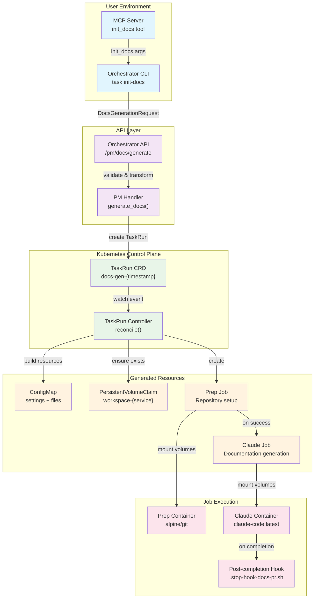
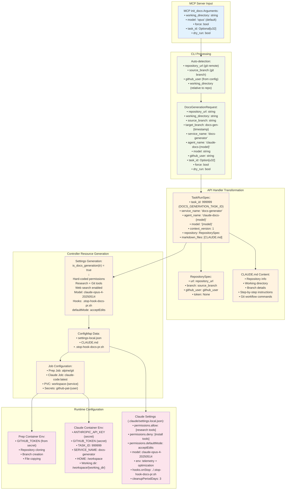
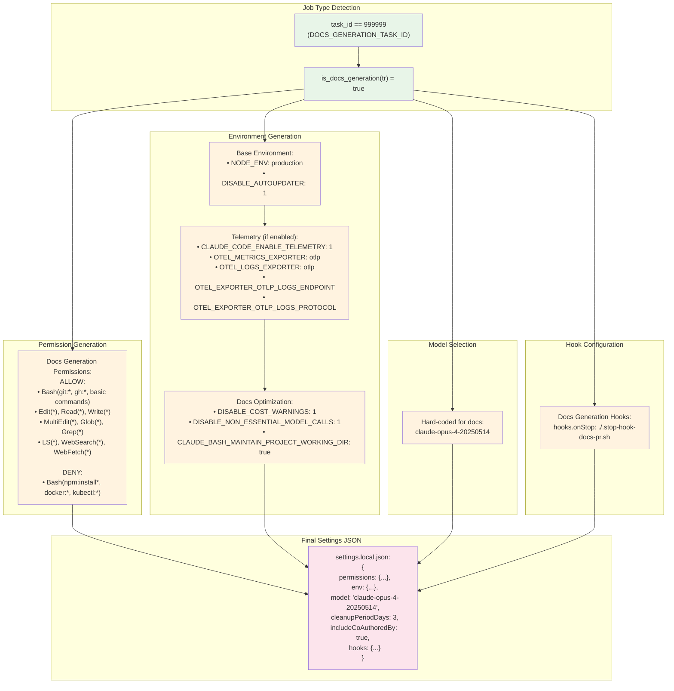
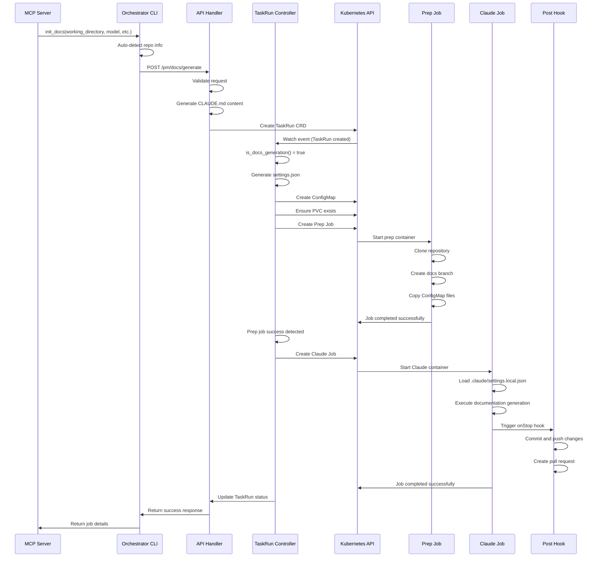

# Orchestrator Flow Diagram

This document provides a visual representation of the complete flow from MCP server to job execution, including all configuration details and data transformations.

## Overview Flow

## Detailed Configuration Flow

## Settings Generation Detail

## Job Execution Sequence

## Key Configuration Points

### 1. **MCP → CLI Transformation**
- Auto-detection of git repository information
- Generation of unique target branch names
- Default model selection (opus for docs)

### 2. **CLI → API Transformation**
- DocsGenerationRequest structure
- Repository specification
- Service and agent naming

### 3. **API → TaskRun Transformation**
- Hard-coded task_id (999999) for docs generation
- CLAUDE.md content generation with instructions
- Repository spec mapping

### 4. **Controller Settings Generation**
- Job type detection via is_docs_generation()
- Hard-coded permissions for research and git operations
- Model override to claude-opus-4-20250514
- Hook configuration for automated PR creation

### 5. **Runtime Configuration**
- Container environment variables (secrets, metadata)
- Claude settings file (.claude/settings.local.json)
- Volume mounts (workspace PVC, ConfigMap)
- Hook script execution on completion

This flow ensures consistent, optimized configuration for documentation generation while maintaining flexibility for other job types.