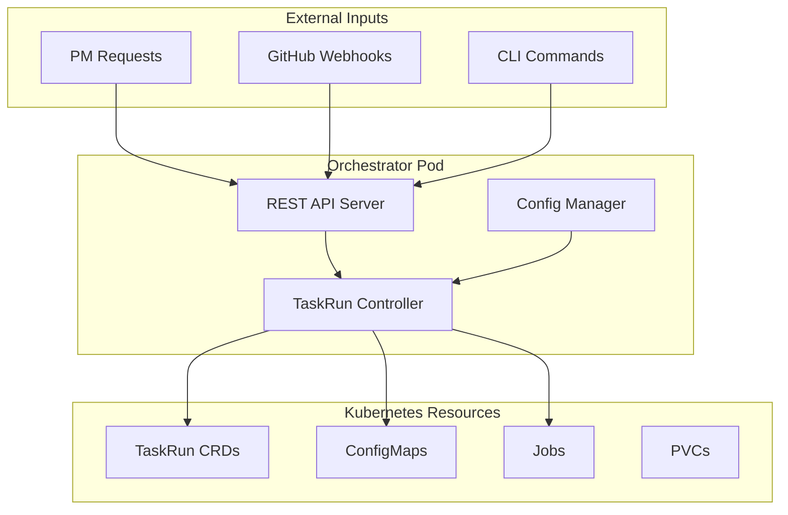
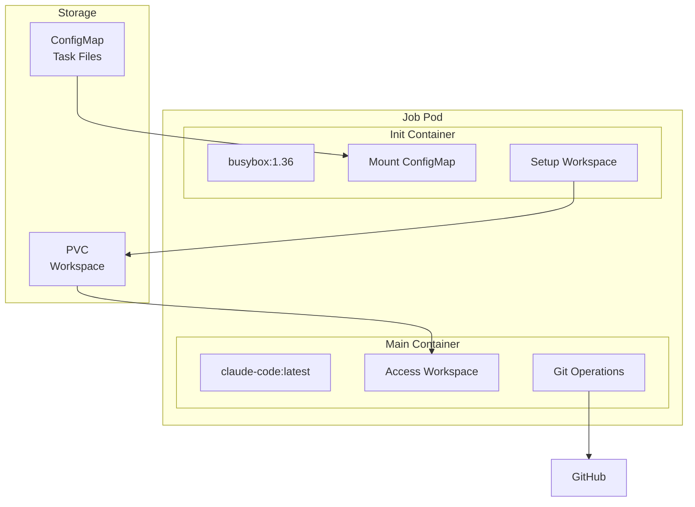
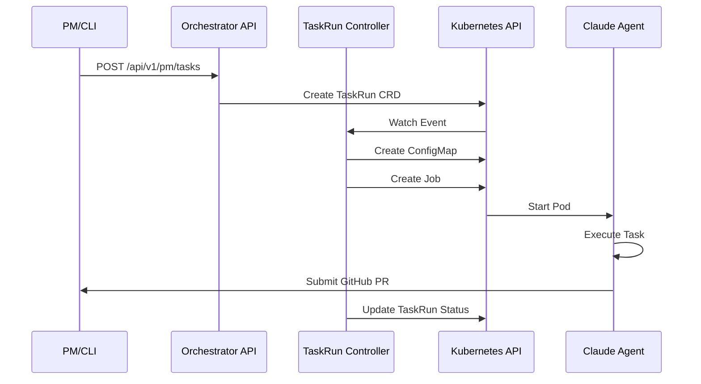
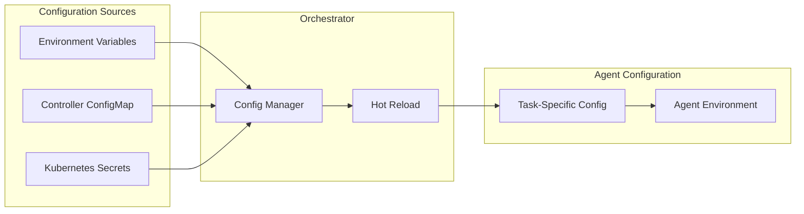
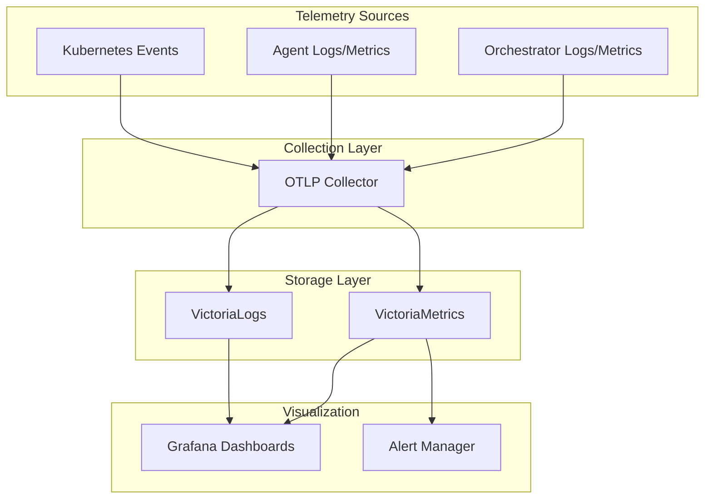

# Platform Architecture Guide

## Overview

The 5D Labs Platform is a Kubernetes-native multi-agent AI development platform designed for autonomous software development at scale. The architecture centers around the TaskRun Custom Resource Definition (CRD) pattern for deploying and managing Claude Code agents.

## Core Architecture Principles

### 1. Kubernetes-Native Design
- **Custom Resources**: TaskRun CRD for agent task management
- **Controllers**: Standard Kubernetes controller pattern
- **ConfigMaps**: Configuration and task file storage
- **Jobs**: Batch workload execution for agents
- **RBAC**: Fine-grained permission control

### 2. Autonomous Agent Operations
- **Self-Contained**: Agents operate without human intervention
- **Quality Assurance**: Built-in testing and validation
- **Error Recovery**: Automatic retry and failure handling
- **Progress Tracking**: Real-time status updates

### 3. Scalable Multi-Agent Coordination
- **Task Isolation**: Each agent works in isolated workspace
- **Resource Management**: Configurable CPU/memory allocation
- **Parallel Execution**: Multiple agents can run simultaneously
- **Dependency Handling**: Task sequencing and dependencies

## System Components

### 1. Unified Orchestrator Service

The central control plane managing all agent operations.



**Key Features**:
- **Unified Service**: Single binary containing both API server and controller
- **Hot Configuration**: Runtime config updates via ConfigMaps
- **Status Management**: Real-time task status tracking
- **Resource Lifecycle**: Automatic cleanup with finalizers

### 2. TaskRun CRD System

Kubernetes-native resource definition for agent tasks.

```yaml
apiVersion: orchestrator.io/v1
kind: TaskRun
metadata:
  name: service-task-id
  namespace: orchestrator
spec:
  taskId: 1001
  serviceName: "auth-service"
  priority: "high"
  markdownFiles:
    - filename: "task.md"
      content: "..."
      fileType: "task"
  retryAttempt: 1
status:
  phase: "Running"
  conditions: [...]
  configMapName: "service-task-id-files"
  jobName: "service-task-id-job"
```

**Lifecycle Management**:
1. **Creation**: TaskRun submitted via API
2. **Validation**: Schema validation and dependency checks
3. **Resource Creation**: ConfigMaps and Jobs created
4. **Monitoring**: Status updates throughout execution
5. **Cleanup**: Finalizers ensure proper resource cleanup

### 3. Agent Deployment Pattern

Init container pattern for workspace preparation.



**Workspace Structure**:
```
/workspace/{service}/
├── .task/{task-id}/run-{attempt}/
│   ├── task.md
│   ├── design-spec.md
│   ├── prompt.md
│   └── metadata.yaml
├── src/           # Service source code
├── tests/         # Test suite
└── CLAUDE.md      # Agent instructions with @imports
```

## Data Flow Architecture

### 1. Task Submission Flow



### 2. Configuration Management



### 3. Monitoring and Observability



## Scalability Patterns

### 1. Horizontal Scaling

**Controller Scaling**:
- Single controller instance (leader election for HA)
- Handles hundreds of concurrent TaskRuns
- Efficient event-driven reconciliation

**Agent Scaling**:
- Unlimited parallel agent execution
- Resource-based scheduling with node affinity
- Independent workspace isolation

### 2. Resource Management

**CPU/Memory Allocation**:
```yaml
# High-priority tasks
resources:
  requests:
    cpu: "2"
    memory: "4Gi"
  limits:
    cpu: "4"
    memory: "8Gi"

# Standard tasks
resources:
  requests:
    cpu: "1"
    memory: "2Gi"
  limits:
    cpu: "2"
    memory: "4Gi"
```

**Storage Patterns**:
- **Per-Service PVCs**: Shared workspace across task attempts
- **Local Path Provisioner**: Fast local storage for development
- **Network Storage**: Persistent storage for production

### 3. Multi-Tenancy

**Namespace Isolation**:
```
orchestrator/        # Controller and shared resources
├── taskruns         # All TaskRun resources
├── configmaps       # Task configuration
└── jobs             # Agent execution jobs

{tenant}-workspace/  # Per-tenant workspaces
├── pvcs             # Workspace storage
└── secrets          # Tenant-specific secrets
```

## Security Architecture

### 1. Authentication & Authorization

**RBAC Model**:
```yaml
# Controller Service Account
apiVersion: rbac.authorization.k8s.io/v1
kind: Role
metadata:
  name: taskrun-controller
rules:
- apiGroups: ["orchestrator.io"]
  resources: ["taskruns"]
  verbs: ["*"]
- apiGroups: ["batch"]
  resources: ["jobs"]
  verbs: ["create", "get", "list", "watch", "delete"]
- apiGroups: [""]
  resources: ["configmaps", "secrets"]
  verbs: ["create", "get", "list", "delete"]
```

**Agent Permissions**:
- **Read-Only Access**: Task configuration and secrets
- **GitHub Access**: Scoped to specific repositories
- **No Cluster Access**: Agents cannot access Kubernetes API

### 2. Secret Management

**Secret Categories**:
- **API Keys**: Anthropic API key for Claude access
- **GitHub Tokens**: Repository access for PR submission
- **Service Credentials**: Database/API access for testing

**Secret Injection**:
```yaml
env:
- name: ANTHROPIC_API_KEY
  valueFrom:
    secretKeyRef:
      name: orchestrator-secrets
      key: ANTHROPIC_API_KEY
```

### 3. Network Security

**Pod Security Standards**:
```yaml
securityContext:
  runAsNonRoot: true
  runAsUser: 1000
  fsGroup: 2000
  seccompProfile:
    type: RuntimeDefault
```

**Network Policies**:
- Agents can access external APIs (GitHub, package registries)
- Agents cannot access other cluster services
- Controller has limited cluster API access

## Performance Optimization

### 1. Controller Performance

**Efficient Reconciliation**:
- Event-driven processing (no polling)
- Kubernetes client caching
- Server-side apply for conflict resolution
- Finalizer-based cleanup

**Resource Optimization**:
```yaml
resources:
  requests:
    cpu: "250m"
    memory: "512Mi"
  limits:
    cpu: "500m"
    memory: "1Gi"
```

### 2. Agent Performance

**Fast Startup**:
- Pre-built container images with dependencies
- Init container for rapid workspace setup
- Shared workspace PVCs for file reuse

**Execution Optimization**:
- Cargo build caching between attempts
- Git shallow clones for faster checkout
- Parallel test execution where possible

### 3. Storage Performance

**Workspace Optimization**:
- Local SSD storage for active workspaces
- Automated cleanup of completed tasks
- Compressed storage for archived attempts

## High Availability

### 1. Controller Availability

**Single Instance Design**:
- Kubernetes Deployment with automatic restart
- PodDisruptionBudget for controlled disruption
- Fast recovery with persistent state in etcd

**Failure Handling**:
- TaskRun reconciliation resumes after restart
- In-flight jobs continue execution
- Finalizers ensure cleanup even after crashes

### 2. Agent Resilience

**Job-Based Execution**:
- Kubernetes Job manages agent pod lifecycle
- Automatic restart on node failure
- Configurable backoff and retry limits

**Workspace Persistence**:
- PVCs survive pod failures
- Multi-attach for node migration
- Backup strategies for critical workspaces

## Deployment Patterns

### 1. Development Environment

**Kind Cluster Setup**:
```bash
# Create local cluster
kind create cluster --config kind-config.yaml

# Install CRDs
kubectl apply -f infra/crds/

# Deploy orchestrator
helm install orchestrator ./infra/charts/orchestrator
```

**Development Workflow**:
1. Local testing with Kind cluster
2. CI validation with ephemeral clusters
3. Integration testing with staging environment

### 2. Production Deployment

**Multi-Zone Deployment**:
```yaml
# Node affinity for controller
affinity:
  podAntiAffinity:
    preferredDuringSchedulingIgnoredDuringExecution:
    - weight: 100
      podAffinityTerm:
        labelSelector:
          matchLabels:
            app: orchestrator
        topologyKey: kubernetes.io/hostname
```

**Production Checklist**:
- [ ] TLS certificates configured
- [ ] Resource limits set appropriately
- [ ] Monitoring and alerting configured
- [ ] Backup procedures tested
- [ ] Security policies applied

## Troubleshooting Guide

### 1. Controller Issues

**Common Problems**:
- RBAC permission errors
- Configuration validation failures
- Resource creation conflicts

**Debugging Commands**:
```bash
# Controller logs
kubectl logs -n orchestrator -l app=orchestrator -f

# TaskRun status
kubectl describe taskrun {name} -n orchestrator

# Controller metrics
kubectl port-forward -n orchestrator svc/orchestrator 8080:80
curl http://localhost:8080/metrics
```

### 2. Agent Issues

**Common Problems**:
- Compilation failures
- Test failures
- Resource constraints
- Network connectivity

**Debugging Commands**:
```bash
# Agent logs
kubectl logs -n orchestrator -l task-id={id} -f

# Workspace inspection
kubectl exec -it {pod-name} -n orchestrator -- bash

# Resource usage
kubectl top pods -n orchestrator
```

## Migration Strategies

### 1. From Helm-Based System

**Migration Steps**:
1. Deploy TaskRun CRD alongside existing system
2. Migrate task submission to new API endpoints
3. Validate agent behavior with CRD deployment
4. Deprecate old Helm-based deployment system
5. Remove legacy components

### 2. Configuration Migration

**Helm Values → ConfigMap**:
```bash
# Extract current configuration
helm get values orchestrator > current-config.yaml

# Convert to ConfigMap format
./scripts/convert-helm-to-configmap.sh current-config.yaml
```

## Future Architecture Evolution

### 1. Multi-Agent Collaboration

**Agent Coordination**:
- Task dependency graphs
- Shared workspace synchronization
- Cross-agent communication patterns

### 2. Advanced Scheduling

**Intelligent Placement**:
- Resource-aware scheduling
- Affinity-based co-location
- Priority-based preemption

### 3. Service Mesh Integration

**Enhanced Observability**:
- Distributed tracing across agents
- Traffic policies and security
- Advanced load balancing

### 4. GitOps Integration

**Declarative Management**:
- TaskRun definitions in Git
- ArgoCD/Flux integration
- Infrastructure as Code patterns