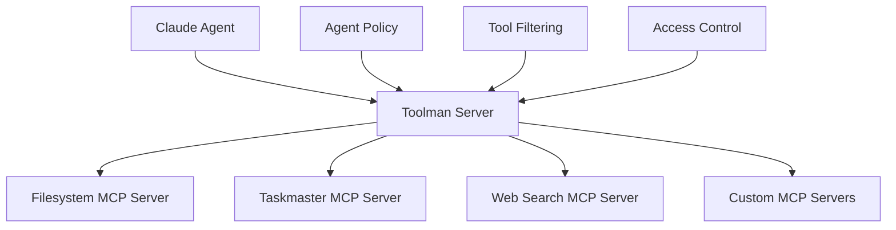
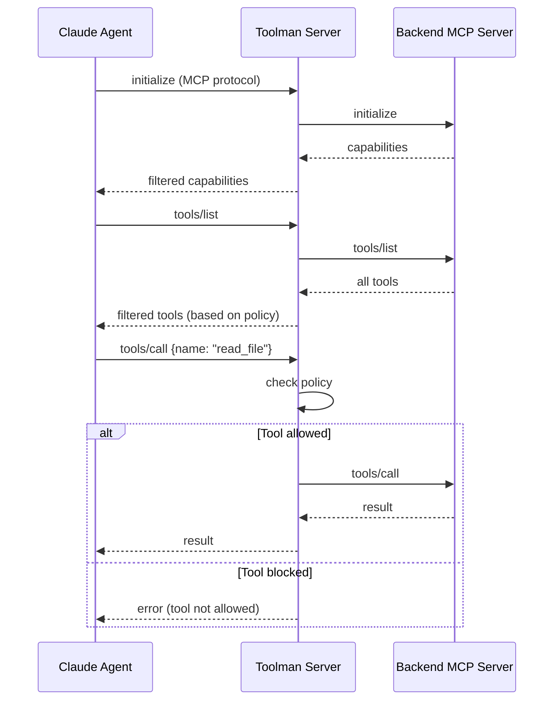

# Toolman Integration Guide

## Overview

Toolman is a tool management proxy server that provides fine-grained control over which MCP (Model Context Protocol) tools are available to agents running in the platform. It acts as a middleware layer between agents and actual MCP tool servers, enabling security, access control, and tool filtering.

## Architecture



## Key Features

- **Tool Filtering**: Control which tools are available to specific agents
- **Access Control**: Agent-specific permissions for tool usage
- **Standard Output MCP**: Uses stdout protocol for cloud code compatibility
- **Sidecar Architecture**: Runs as a sidecar container alongside agent containers
- **Dynamic Configuration**: Hot-reloadable tool policies and server configurations

## Configuration

### Controller Configuration

Add toolman configuration to your TaskRun controller ConfigMap:

```yaml
# Enable toolman in your controller config
toolman:
  enabled: true
  image:
    repository: "ghcr.io/5dlabs/platform/toolman"
    tag: "latest"
    pullPolicy: "IfNotPresent"
  resources:
    requests:
      cpu: "100m"
      memory: "256Mi"
    limits:
      cpu: "500m" 
      memory: "512Mi"
  env:
    - name: LOG_LEVEL
      value: "info"
    - name: RUST_LOG
      value: "toolman=debug,info"
  configPath: "/workspace/toolman.json"
  port: 3000
```

### Toolman Server Configuration

Create a `toolman.json` configuration file:

```json
{
  "servers": {
    "filesystem": {
      "command": "node",
      "args": ["@modelcontextprotocol/server-filesystem", "/workspace"],
      "env": {},
      "enabled": true
    },
    "taskmaster": {
      "command": "task-master",
      "args": ["mcp"],
      "env": {
        "TASKMASTER_LOG_LEVEL": "info"
      },
      "enabled": true
    },
    "web-search": {
      "command": "python",
      "args": ["-m", "mcp_web_search"],
      "env": {
        "SEARCH_API_KEY": "${SEARCH_API_KEY}"
      },
      "enabled": false
    }
  },
  "default_access": {
    "allowed_tools": [],
    "blocked_tools": ["dangerous_tool", "system_modify"],
    "allow_unknown": true
  },
  "agent_policies": {
    "claude": {
      "allowed_tools": ["read_file", "write_file", "search_web", "get_tasks", "add_task"],
      "blocked_tools": ["delete_all", "system_shutdown"],
      "allow_unknown": false
    },
    "gemini": {
      "allowed_tools": ["read_file", "search_web", "get_tasks"],
      "blocked_tools": ["write_file", "delete_file"],
      "allow_unknown": false
    }
  }
}
```

## How It Works

### 1. Sidecar Deployment

When toolman is enabled, the TaskRun controller automatically adds a toolman sidecar container to agent pods:

- **Main Container**: Claude agent
- **Sidecar Container**: Toolman server
- **Communication**: localhost HTTP on configured port (default: 3000)

### 2. MCP Protocol Flow



### 3. Tool Access Control

Toolman evaluates tool access using:

1. **Agent-specific policies**: Define allowed/blocked tools per agent
2. **Default access policy**: Fallback policy for unspecified agents
3. **Global blocked tools**: Tools that are never allowed

## Environment Variables

### For Claude Agent

When toolman is enabled, the agent receives:

```bash
MCP_TOOLMAN_ENABLED=true
MCP_TOOLMAN_SERVER_URL=http://localhost:3000
```

### For Toolman Server

```bash
TOOLMAN_CONFIG_PATH=/workspace/toolman.json
TOOLMAN_PORT=3000
AGENT_NAME=claude-agent-1
TASK_ID=1001
SERVICE_NAME=auth-service
LOG_LEVEL=info
RUST_LOG=toolman=debug,info
```

## Security Features

### Access Control

- **Whitelist-based**: Only explicitly allowed tools are available
- **Blacklist support**: Block specific dangerous tools
- **Agent isolation**: Different tool sets per agent type

### Tool Filtering

```json
{
  "agent_policies": {
    "claude": {
      "allowed_tools": [
        "read_file",
        "write_file", 
        "list_directory",
        "search_web",
        "get_tasks",
        "add_task"
      ],
      "blocked_tools": [
        "delete_file",
        "system_command",
        "network_access"
      ],
      "allow_unknown": false
    }
  }
}
```

### Audit Logging

All tool calls are logged with:

- Agent identifier
- Tool name and parameters
- Access decision (allowed/denied)
- Timestamp and session information

## Deployment

### Using the Platform

1. **Enable in Controller Config**:
   ```bash
   kubectl patch configmap taskrun-controller-config -n orchestrator \
     --patch '{"data":{"config.yaml":"$(cat config-with-toolman.yaml)"}}'
   ```

2. **Submit Tasks**:
   ```bash
   # Tasks automatically get toolman sidecar when enabled
   curl -X POST http://orchestrator.local/api/v1/pm/tasks \
     -H "Content-Type: application/json" \
     -d @task-with-toolman.json
   ```

### Building the Image

```bash
# Build toolman image
cd orchestrator
docker build -f Dockerfile.toolman -t ghcr.io/5dlabs/platform/toolman:latest .

# Push to registry
docker push ghcr.io/5dlabs/platform/toolman:latest
```

## Monitoring

### Health Checks

Toolman includes a health endpoint that verifies:

- Server is responding to MCP messages
- Backend servers are accessible
- Configuration is valid

### Metrics

Key metrics to monitor:

- Tool call success/failure rates
- Access control decisions (allowed/denied)
- Backend server health
- Response latencies

### Logging

```bash
# View toolman logs
kubectl logs -n orchestrator -l app=claude-agent,component=toolman -f

# View agent logs  
kubectl logs -n orchestrator -l app=claude-agent,component=agent -f
```

## Troubleshooting

### Common Issues

1. **Tools Not Available**:
   ```bash
   # Check toolman configuration
   kubectl exec -it <pod-name> -c toolman -- cat /workspace/toolman.json
   
   # Check backend server status
   kubectl logs <pod-name> -c toolman | grep "backend server"
   ```

2. **Permission Denied**:
   ```bash
   # Check agent policy
   kubectl logs <pod-name> -c toolman | grep "access denied"
   
   # Verify tool is in allowed list
   kubectl exec -it <pod-name> -c toolman -- \
     echo '{"method":"tools/list","id":1}' | nc localhost 3000
   ```

3. **Sidecar Not Starting**:
   ```bash
   # Check toolman configuration in controller config
   kubectl get configmap taskrun-controller-config -n orchestrator -o yaml
   
   # Verify image is available
   kubectl describe pod <pod-name> | grep toolman
   ```

### Debug Mode

Enable debug logging:

```yaml
toolman:
  env:
    - name: RUST_LOG
      value: "toolman=debug,trace"
```

## Migration Guide

### From Direct MCP Integration

1. **Identify Current Tools**: List all MCP servers currently used
2. **Create Tool Policies**: Define allowed tools per agent
3. **Update Configuration**: Enable toolman in controller config
4. **Test Gradually**: Start with permissive policies, then restrict

### Configuration Migration

```bash
# Before (direct MCP)
{
  "mcp_servers": ["filesystem", "taskmaster"]
}

# After (with toolman)
{
  "toolman": {
    "enabled": true,
    "servers": {
      "filesystem": {"enabled": true},
      "taskmaster": {"enabled": true}
    }
  }
}
```

## Best Practices

### Security

1. **Principle of Least Privilege**: Only allow tools that agents actually need
2. **Regular Audits**: Review tool usage logs periodically
3. **Staged Rollout**: Test new tool policies in development first

### Performance

1. **Resource Limits**: Set appropriate CPU/memory limits for toolman
2. **Connection Pooling**: Reuse connections to backend servers
3. **Caching**: Cache tool lists and schemas when possible

### Monitoring

1. **Alert on Denials**: Monitor for unexpected tool access denials
2. **Track Usage**: Monitor which tools are used most frequently
3. **Health Checks**: Ensure toolman and backend servers are healthy

## API Reference

### MCP Protocol Support

Toolman implements the full MCP 2024-11-05 specification:

- `initialize`: Server initialization
- `tools/list`: List available tools (filtered)
- `tools/call`: Execute tool (with access control)
- `resources/list`: List resources (proxied)
- `resources/read`: Read resources (proxied)
- `prompts/list`: List prompts (proxied)
- `prompts/get`: Get prompt (proxied)

### Configuration Schema

See `toolman.json` schema documentation for complete configuration options.

## Examples

### Basic Filesystem Access

```json
{
  "servers": {
    "filesystem": {
      "command": "node",
      "args": ["@modelcontextprotocol/server-filesystem", "/workspace"],
      "enabled": true
    }
  },
  "agent_policies": {
    "claude": {
      "allowed_tools": ["read_file", "write_file", "list_directory"],
      "blocked_tools": [],
      "allow_unknown": false
    }
  }
}
```

### Web Search Integration

```json
{
  "servers": {
    "web-search": {
      "command": "python",
      "args": ["-m", "mcp_web_search"],
      "env": {
        "SEARCH_API_KEY": "${SEARCH_API_KEY}"
      },
      "enabled": true
    }
  },
  "agent_policies": {
    "research-agent": {
      "allowed_tools": ["web_search", "read_file"],
      "allow_unknown": false
    }
  }
}
```

### Development vs Production

```json
{
  "agent_policies": {
    "development": {
      "allowed_tools": ["*"],
      "blocked_tools": ["system_shutdown"],
      "allow_unknown": true
    },
    "production": {
      "allowed_tools": ["read_file", "write_file", "get_tasks"],
      "blocked_tools": ["system_command", "network_access"],
      "allow_unknown": false
    }
  }
}
```