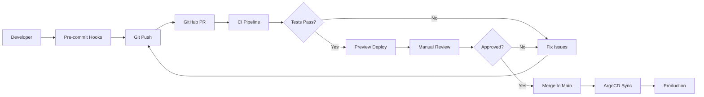

# Infrastructure Testing Strategy for ArgoCD Applications

This document outlines testing strategies for validating infrastructure changes before merging to production.

## Testing Levels

### 1. Static Validation (Pre-commit)
Fast, local checks that run before code is committed.

### 2. CI Pipeline Validation (Pull Request)
Automated tests that run on every pull request.

### 3. Preview Environments (Pre-merge)
Ephemeral environments for testing actual deployments.

### 4. Progressive Rollout (Post-merge)
Staged deployment through environments.

## Implementation Strategies

### Level 1: Static Validation Tools

#### YAML Linting
```yaml
# .pre-commit-config.yaml
repos:
  - repo: https://github.com/adrienverge/yamllint
    rev: v1.33.0
    hooks:
      - id: yamllint
        args: [-c=.yamllint.yaml]
        files: ^infra/gitops/.*\.yaml$

  - repo: https://github.com/syntaqx/kube-score
    rev: v1.16.1
    hooks:
      - id: kube-score
        files: ^infra/gitops/.*\.yaml$
```

#### ArgoCD Schema Validation
```yaml
# .github/workflows/validate-argocd.yaml
name: Validate ArgoCD Applications
on:
  pull_request:
    paths:
      - 'infra/gitops/**/*.yaml'

jobs:
  validate:
    runs-on: ubuntu-latest
    steps:
      - uses: actions/checkout@v4
      
      - name: Setup kubeconform
        run: |
          wget https://github.com/yannh/kubeconform/releases/latest/download/kubeconform-linux-amd64.tar.gz
          tar xf kubeconform-linux-amd64.tar.gz
          sudo mv kubeconform /usr/local/bin
      
      - name: Validate ArgoCD Applications
        run: |
          # Download ArgoCD CRD schemas
          curl -L https://raw.githubusercontent.com/argoproj/argo-cd/stable/manifests/crds/application-crd.yaml \
            -o /tmp/argocd-application-crd.yaml
          
          # Validate all application manifests
          find infra/gitops/applications -name "*.yaml" -exec \
            kubeconform -schema-location /tmp/argocd-application-crd.yaml {} \;
```

### Level 2: CI Pipeline Testing

#### Helm Template Rendering
```yaml
# .github/workflows/test-helm-charts.yaml
name: Test Helm Charts
on:
  pull_request:
    paths:
      - 'infra/charts/**'
      - 'infra/gitops/applications/**'

jobs:
  helm-test:
    runs-on: ubuntu-latest
    steps:
      - uses: actions/checkout@v4
      
      - name: Setup Helm
        uses: azure/setup-helm@v3
        with:
          version: 'latest'
      
      - name: Add Helm repositories
        run: |
          helm repo add bitnami https://charts.bitnami.com/bitnami
          helm repo add prometheus https://prometheus-community.github.io/helm-charts
          helm repo add grafana https://grafana.github.io/helm-charts
          helm repo add zalando https://opensource.zalando.com/postgres-operator/charts/postgres-operator
          helm repo update
      
      - name: Template and validate charts
        run: |
          # For each ArgoCD app that uses Helm
          for app in infra/gitops/applications/*.yaml; do
            # Extract helm chart info (simplified example)
            if grep -q "chart:" $app; then
              echo "Testing $app"
              # Extract chart and values, then template
              # This is simplified - you'd parse YAML properly
              helm template test-release ... --dry-run
            fi
          done
      
      - name: Run Helm lint
        run: |
          for chart in infra/charts/*/; do
            helm lint $chart
          done
```

#### Policy Validation with OPA
```yaml
# .github/workflows/opa-validation.yaml
name: OPA Policy Validation
on:
  pull_request:
    paths:
      - 'infra/gitops/**'

jobs:
  opa:
    runs-on: ubuntu-latest
    steps:
      - uses: actions/checkout@v4
      
      - name: Setup OPA
        run: |
          curl -L -o opa https://openpolicyagent.org/downloads/latest/opa_linux_amd64
          chmod +x opa
          sudo mv opa /usr/local/bin
      
      - name: Run OPA policies
        run: |
          # Validate resource limits, security contexts, etc.
          opa eval -d infra/policies/rego -i infra/gitops/databases/*.yaml \
            "data.kubernetes.admission.deny[msg]"
```

### Level 3: Preview Environments

#### ArgoCD ApplicationSets for PRs
```yaml
# infra/gitops/applicationsets/pr-preview.yaml
apiVersion: argoproj.io/v1alpha1
kind: ApplicationSet
metadata:
  name: pr-preview-apps
  namespace: argocd
spec:
  generators:
  - pullRequest:
      github:
        owner: 5dlabs
        repo: cto
        labels:
        - preview
      requeueAfterSeconds: 30
  
  template:
    metadata:
      name: 'preview-{{number}}-{{branch}}'
      namespace: argocd
      labels:
        environment: preview
        pr-number: '{{number}}'
    spec:
      project: default
      source:
        repoURL: https://github.com/5dlabs/cto
        targetRevision: '{{branch}}'
        path: infra/gitops
      
      destination:
        server: https://kubernetes.default.svc
        namespace: 'preview-{{number}}'
      
      syncPolicy:
        automated:
          prune: true
          selfHeal: true
        syncOptions:
        - CreateNamespace=true
      
      # Auto-delete after PR closes
      revisionHistoryLimit: 0
```

#### Ephemeral Cluster Testing
```yaml
# .github/workflows/ephemeral-test.yaml
name: Ephemeral Cluster Test
on:
  pull_request:
    paths:
      - 'infra/gitops/**'
    types: [opened, synchronize]

jobs:
  test-deployment:
    runs-on: ubuntu-latest
    steps:
      - uses: actions/checkout@v4
      
      - name: Create k3d cluster
        run: |
          curl -s https://raw.githubusercontent.com/k3d-io/k3d/main/install.sh | bash
          k3d cluster create test-cluster --agents 2
      
      - name: Install ArgoCD
        run: |
          kubectl create namespace argocd
          kubectl apply -n argocd -f https://raw.githubusercontent.com/argoproj/argo-cd/stable/manifests/install.yaml
          
          # Wait for ArgoCD to be ready
          kubectl wait --for=condition=available --timeout=300s \
            deployment/argocd-server -n argocd
      
      - name: Deploy test applications
        run: |
          # Apply only the changed applications
          for file in $(git diff --name-only HEAD~1 -- 'infra/gitops/applications/*.yaml'); do
            echo "Testing $file"
            kubectl apply -f $file
          done
      
      - name: Wait for sync
        run: |
          # Wait for applications to sync
          kubectl wait --for=condition=Synced --timeout=300s \
            applications --all -n argocd
      
      - name: Run smoke tests
        run: |
          # Run basic validation tests
          ./scripts/smoke-tests.sh
      
      - name: Cleanup
        if: always()
        run: |
          k3d cluster delete test-cluster
```

### Level 4: Diff Preview

#### ArgoCD Diff Comment Bot
```yaml
# .github/workflows/argocd-diff.yaml
name: ArgoCD Diff
on:
  pull_request:
    paths:
      - 'infra/gitops/**'

jobs:
  diff:
    runs-on: ubuntu-latest
    steps:
      - uses: actions/checkout@v4
      
      - name: Setup ArgoCD CLI
        run: |
          curl -sSL -o /usr/local/bin/argocd \
            https://github.com/argoproj/argo-cd/releases/latest/download/argocd-linux-amd64
          chmod +x /usr/local/bin/argocd
      
      - name: Login to ArgoCD
        run: |
          argocd login ${{ secrets.ARGOCD_SERVER }} \
            --username ${{ secrets.ARGOCD_USERNAME }} \
            --password ${{ secrets.ARGOCD_PASSWORD }} \
            --insecure
      
      - name: Generate diff
        id: diff
        run: |
          # For each modified application
          for app in $(git diff --name-only HEAD~1 -- 'infra/gitops/applications/*.yaml'); do
            app_name=$(basename $app .yaml)
            echo "## Diff for $app_name" >> diff.md
            argocd app diff $app_name --local $app >> diff.md || true
            echo "" >> diff.md
          done
      
      - name: Comment PR
        uses: actions/github-script@v7
        with:
          script: |
            const fs = require('fs');
            const diff = fs.readFileSync('diff.md', 'utf8');
            github.rest.issues.createComment({
              issue_number: context.issue.number,
              owner: context.repo.owner,
              repo: context.repo.repo,
              body: `### ArgoCD Diff Preview\n\n${diff}`
            });
```

## Testing Workflow



## Recommended Implementation Order

1. **Phase 1: Basic Validation** (Week 1)
   - YAML linting
   - Schema validation
   - Pre-commit hooks

2. **Phase 2: CI Integration** (Week 2)
   - GitHub Actions workflows
   - Helm chart testing
   - Basic policy checks

3. **Phase 3: Preview Environments** (Week 3-4)
   - ArgoCD ApplicationSets
   - PR preview namespaces
   - Automated cleanup

4. **Phase 4: Advanced Testing** (Week 5-6)
   - Ephemeral cluster testing
   - Integration tests
   - Performance benchmarks

## Tools Summary

| Tool | Purpose | Stage |
|------|---------|-------|
| yamllint | YAML syntax validation | Pre-commit |
| kubeconform | Kubernetes schema validation | CI |
| kube-score | Best practices validation | CI |
| Helm | Chart rendering and linting | CI |
| OPA | Policy enforcement | CI |
| ArgoCD CLI | Diff generation | CI |
| k3d/kind | Ephemeral clusters | CI |
| ApplicationSets | Preview environments | Pre-merge |

## Example Policy Rules

```rego
# infra/policies/rego/argocd.rego
package kubernetes.admission

import future.keywords.contains
import future.keywords.if
import future.keywords.in

# Deny if application doesn't have required labels
deny[msg] {
    input.kind == "Application"
    required_labels := {"team", "environment", "app.kubernetes.io/name"}
    missing := required_labels - {l | l := input.metadata.labels[_]}
    count(missing) > 0
    msg := sprintf("Application %s missing required labels: %v", [input.metadata.name, missing])
}

# Deny if sync policy is too aggressive for production
deny[msg] {
    input.kind == "Application"
    input.metadata.labels.environment == "production"
    input.spec.syncPolicy.automated.prune == true
    input.spec.syncPolicy.automated.selfHeal == true
    msg := "Production applications should not have both prune and selfHeal enabled"
}

# Require resource limits for database operators
deny[msg] {
    input.kind == "Application"
    contains(input.metadata.name, "operator")
    not input.spec.source.helm.values
    msg := "Operator applications must specify resource limits in helm values"
}
```

## Monitoring Test Results

### Metrics to Track
- PR validation time
- Test failure rate by type
- Preview environment usage
- Time to merge after approval
- Rollback frequency

### Dashboard Example
```yaml
# grafana-dashboard.json snippet
{
  "panels": [
    {
      "title": "ArgoCD Test Success Rate",
      "targets": [
        {
          "expr": "rate(ci_argocd_tests_total{status='success'}[1h]) / rate(ci_argocd_tests_total[1h])"
        }
      ]
    }
  ]
}
```

## Next Steps

1. Start with basic YAML validation
2. Add schema validation for ArgoCD resources
3. Implement preview environments for high-risk changes
4. Gradually add more sophisticated testing
5. Monitor and iterate based on what catches the most issues
