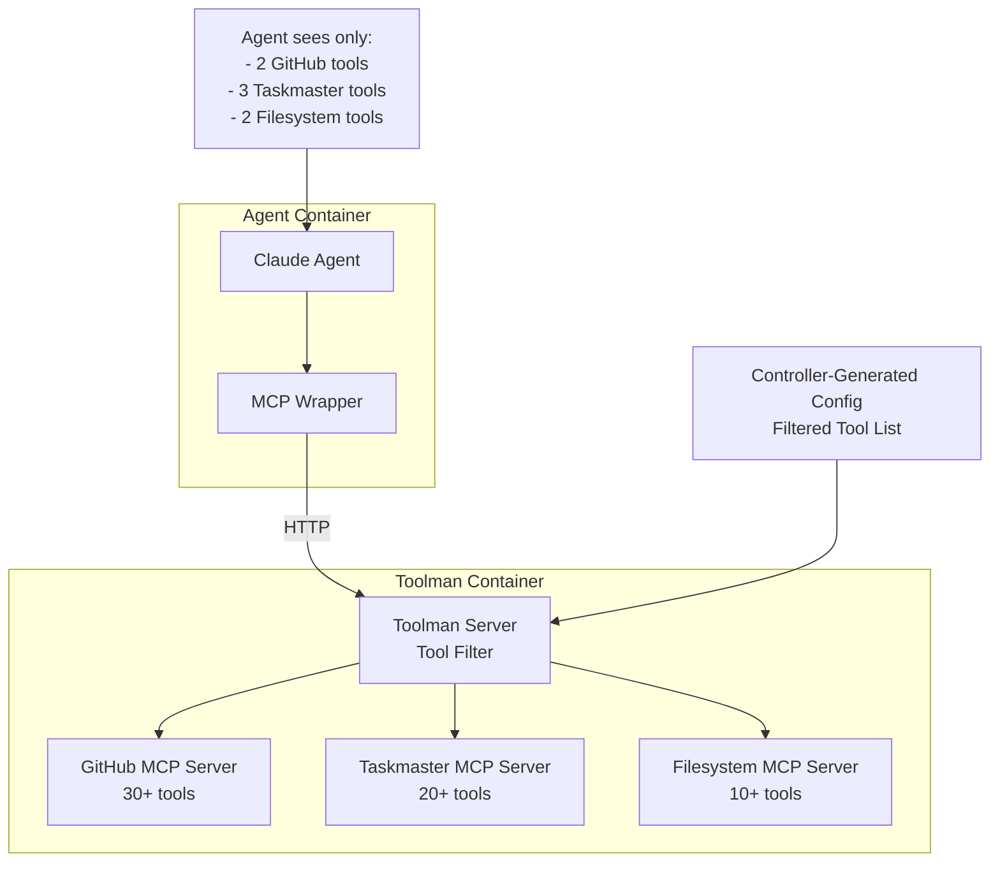

# Toolman Selective Tool Filtering Architecture

## Overview

The Toolman server implements selective tool filtering to provide fine-grained control over which MCP tools are exposed to agents. Rather than building separate MCP servers for each tool subset, we use existing full-featured MCP servers and filter their tools based on configuration.

## Architecture



## Key Concepts

### 1. Full-Featured Backend Servers
- **GitHub MCP Server**: Provides 30+ tools for repository management
- **Taskmaster MCP Server**: Provides 20+ tools for task management
- **Filesystem MCP Server**: Provides 10+ tools for file operations

### 2. Selective Tool Exposure
- Toolman acts as a filtering proxy between agents and backend servers
- Only configured tools are exposed to agents
- Tool filtering is based on:
  - Global `exposed_tools` configuration
  - Agent-specific `tool_overrides`
  - Task-specific requirements

### 3. Configuration-Driven Filtering
- Each TaskRun generates a custom toolman configuration
- Configuration includes only tools needed for that specific task
- No dynamic tool discovery - all tools are pre-configured

## Configuration Structure

### Global Tool Exposure
```json
{
  "exposed_tools": {
    "github": [
      "create_pull_request",
      "get_file_contents"
    ],
    "taskmaster": [
      "get_tasks",
      "add_task",
      "update_task_status"
    ],
    "filesystem": [
      "read_file",
      "write_file"
    ]
  }
}
```

### Agent-Specific Overrides
```json
{
  "agent_policies": {
    "claude-code": {
      "allowed_servers": ["github", "taskmaster", "filesystem"],
      "tool_overrides": {
        "github": ["create_pull_request", "get_file_contents"],
        "taskmaster": ["get_tasks", "add_task"],
        "filesystem": ["read_file", "write_file"]
      }
    }
  }
}
```

## Tool Filtering Process

### 1. Agent Requests Tools (`tools/list`)
1. Agent sends MCP `tools/list` request to toolman
2. Toolman queries all enabled backend servers for their full tool lists
3. Toolman filters tools based on:
   - Agent's `allowed_servers` list
   - Agent's `tool_overrides` (if specified)
   - Global `exposed_tools` (if no overrides)
   - Default policy settings
4. Filtered tool list is returned to agent

### 2. Agent Calls Tool (`tools/call`)
1. Agent sends MCP `tools/call` request to toolman
2. Toolman parses tool name (supports both qualified `server:tool` and unqualified `tool` formats)
3. Toolman checks if tool is allowed for the agent
4. If allowed, toolman forwards request to appropriate backend server
5. Backend server response is returned to agent

### 3. Permission Checking Logic
```rust
async fn is_tool_allowed(&self, tool_name: &str, server_name: &str, agent_id: Option<&str>) -> bool {
    // 1. Check if agent can access this server
    if !agent_policy.allowed_servers.contains(server_name) {
        return false;
    }
    
    // 2. Check agent-specific tool overrides
    if let Some(allowed_tools) = agent_policy.tool_overrides.get(server_name) {
        return allowed_tools.contains(tool_name);
    }
    
    // 3. Fall back to global exposed tools
    if let Some(exposed_tools) = config.exposed_tools.get(server_name) {
        return exposed_tools.contains(tool_name);
    }
    
    // 4. Check default policy
    return config.default_policy.allow_unknown_tools;
}
```

## Task-Specific Configuration Generation

The TaskRun controller generates toolman configurations based on:

### Service Type Detection
- **API/Service tasks**: Get comprehensive GitHub and filesystem tools
- **Frontend/UI tasks**: Get GitHub PR tools and basic filesystem access
- **Testing tasks**: Get additional taskmaster tools for status updates

### Task Description Analysis
- **Testing keywords**: Add test-related tools
- **Deployment keywords**: Add CI/CD workflow tools
- **Documentation keywords**: Add documentation-specific tools

### Example Configuration Generation
```rust
fn generate_toolman_config(tr: &TaskRun) -> String {
    let mut github_tools = vec!["get_file_contents".to_string()];
    let mut taskmaster_tools = vec!["get_tasks".to_string(), "add_task".to_string()];
    let mut filesystem_tools = vec!["read_file".to_string(), "write_file".to_string()];
    
    // Add tools based on service type
    match tr.spec.service_name.as_str() {
        name if name.contains("api") => {
            github_tools.extend(["create_pull_request", "create_branch"]);
            filesystem_tools.extend(["list_directory", "create_directory"]);
        }
        // ... other service types
    }
    
    // Check task description for keywords
    if task_description.contains("test") {
        taskmaster_tools.push("update_task_status".to_string());
    }
    
    // Generate final configuration
    // ...
}
```

## Benefits

### 1. Security
- Agents only see tools they need
- No access to dangerous or unnecessary tools
- Fine-grained permission control

### 2. Performance
- Smaller tool lists for agents
- Faster tool discovery
- Reduced MCP communication overhead

### 3. Maintainability
- Single source of truth for tool definitions
- Easy to add new tools without changing agent code
- Clear audit trail of tool usage

### 4. Flexibility
- Task-specific tool sets
- Agent-specific overrides
- Service-type-based tool selection

## Deployment

### 1. Container Structure
- **Agent Container**: Claude + MCP wrapper
- **Toolman Container**: Toolman server + backend MCP servers
- **Configuration**: Mounted via ConfigMap

### 2. Configuration Flow
1. TaskRun created with task requirements
2. Controller generates toolman configuration
3. Configuration stored in ConfigMap
4. Toolman container mounts configuration at startup
5. Agent connects to toolman via HTTP

### 3. Health Monitoring
- Toolman provides `/health` endpoint
- Kubernetes health checks ensure toolman is ready
- Agent waits for toolman readiness before starting

## Example Use Cases

### Code Development Task
```json
{
  "filesystem": ["read_file", "write_file", "list_directory", "create_directory"],
  "github": ["get_file", "create_pull_request", "create_issue"],
  "git": ["git_log", "git_diff", "read_file"]
}
```

### Research Task
```json
{
  "filesystem": ["read_file", "search_files"],
  "brave-search": ["brave_web_search"],
  "memory": ["create_memories", "search_memories"]
}
```

### Data Analysis Task
```json
{
  "filesystem": ["read_file", "list_directory"],
  "postgresql": ["query", "list_tables", "describe_table"],
  "sqlite": ["query", "list_tables", "describe_table"]
}
```

### Automation Task
```json
{
  "filesystem": ["read_file", "write_file"],
  "puppeteer": ["puppeteer_screenshot", "puppeteer_navigate"],
  "github": ["get_file", "create_issue"]
}
```

## Complete Example Configuration

See `orchestrator/orchestrator-core/src/config/toolman_example.json` for a comprehensive example configuration showing:

- **8 Real MCP Servers**: Official servers from the ModelContextProtocol organization
- **50+ Actual Tools**: Real tool names from filesystem, GitHub, Git, Brave Search, Memory, Puppeteer, PostgreSQL, and SQLite servers
- **5 Agent Personas**: Different tool sets for developer, researcher, analyst, automation, and read-only scenarios
- **Task-Based Selection**: Automatic tool addition based on task keywords (API development, frontend, testing, data analysis, research, deployment)
- **Security Settings**: Dangerous tool lists, confirmation requirements, and audit logging
- **Performance Tuning**: Timeouts, concurrency limits, and caching

### Key Features Demonstrated:

**Server Configuration:**
```json
"filesystem": {
  "command": "npx",
  "args": ["-y", "@modelcontextprotocol/server-filesystem", "/workspace"],
  "description": "Official filesystem MCP server with 10+ file operation tools"
}
```

**Selective Tool Exposure:**
```json
"exposed_tools": {
  "github": [
    "create_repository", "get_file", "create_pull_request",
    "create_issue", "search_repositories", "list_commits"
  ]
}
```

**Agent-Specific Policies:**
```json
"claude-developer": {
  "allowed_servers": ["filesystem", "github", "git"],
  "tool_overrides": {
    "filesystem": ["read_file", "write_file", "list_directory"]
  }
}
```

## Future Enhancements

### 1. Dynamic Tool Discovery
- Runtime tool addition/removal
- Tool capability detection
- Automatic tool categorization

### 2. Advanced Filtering
- Tool usage analytics
- Permission inheritance
- Conditional tool access

### 3. Tool Composition
- Tool chaining capabilities
- Macro tool definitions
- Cross-server tool coordination